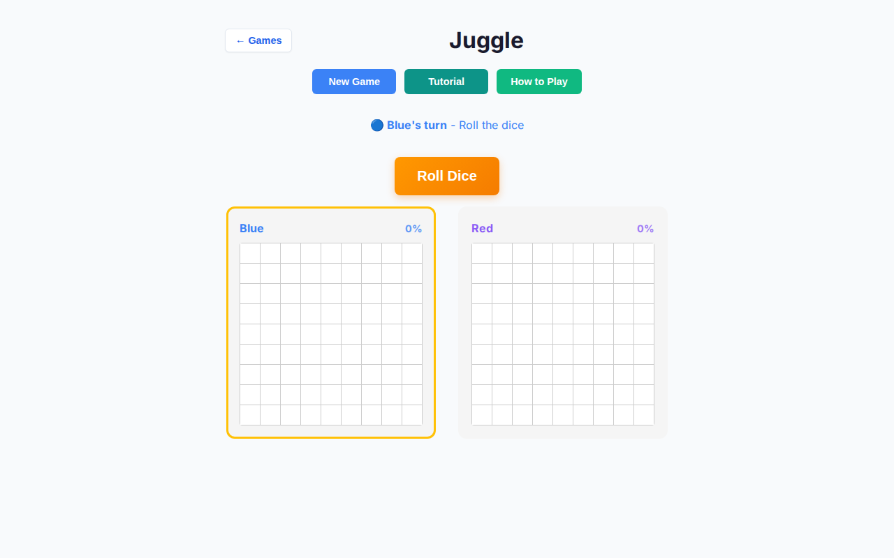
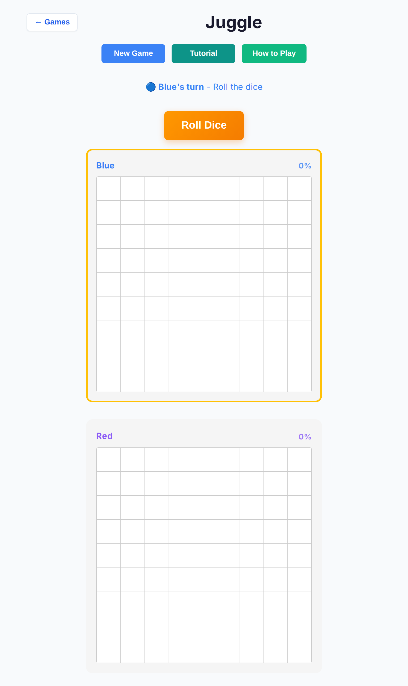
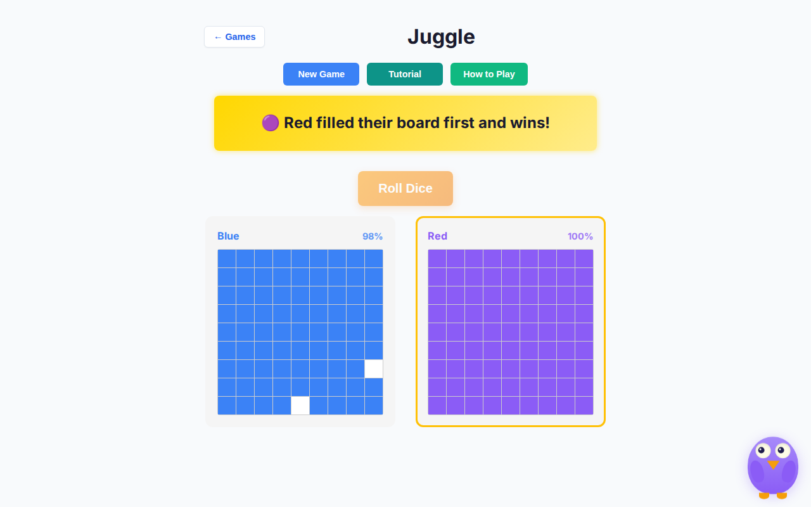
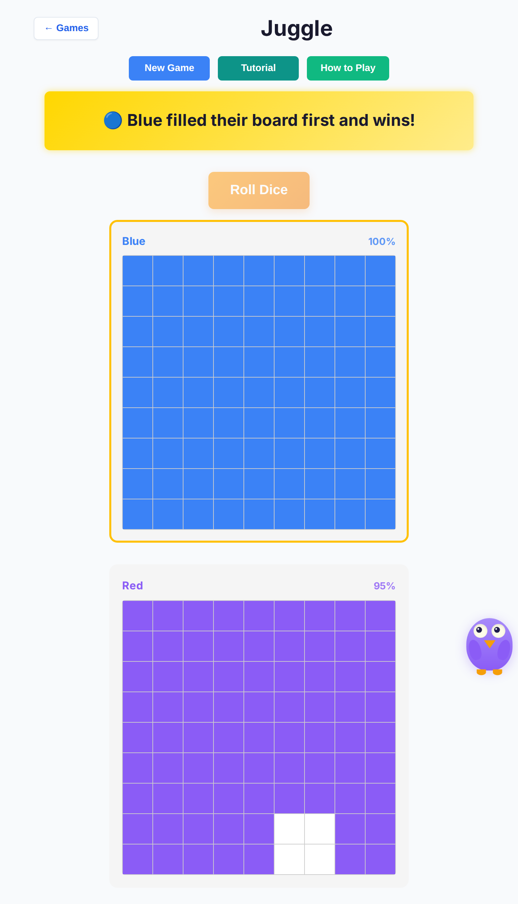
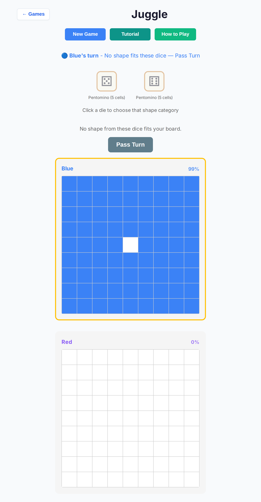

# Juggle deep playtest — 2026-10-07

Branch: `cursor/juggle-deep-playtest-9dde`  
Base: `cursor/overnight-polish-integration-0494`  
Harness: `scripts/juggle-deep-playtest.mjs` → raw data in [`juggle-deep-2026-10-07/results.json`](./juggle-deep-2026-10-07/results.json)

## Method

| Item | Detail |
| --- | --- |
| Mode | Human vs AI (Blue human / Red computer) |
| Difficulties | Easy, Medium, Hard |
| Viewports | Desktop Chromium 1280×800; tablet iPad Mini (768×1024, touch) |
| Games | **10 full games × 3 difficulties × 2 viewports = 60** |
| Driver | Live game shell + `window.__jugglePlaytest.advanceHuman` (same `passTurn` / AI schedule paths as production) |
| Stop | Winner banner / soft-lock / AI stall (~25s) / 200-turn budget |
| Checks | End screen, soft-lock, AI think latency, console errors, tablet cell ≥44px |

Also: Vitest completion suite plays **12 full games × Easy/Medium/Hard** in-process (`tests/unit/juggle-deep-vs-ai-completion.test.ts`).

## Results (headless Chromium)

| Metric | Value |
| --- | --- |
| Games finished with a winner | **60 / 60** |
| Soft-locks | **0** |
| Console-error games | **0** |
| Max AI seat think (harness wait) | **1192 ms** (under 3s budget) |
| Tablet cell size | **44×44 CSS px** (`tabletTouchOk: true`) |
| Outcomes | human-win 36 · ai-win 24 |

### Per viewport × difficulty (10 games each)

| Slice | Wins | Soft-lock | Max AI think |
| --- | --- | --- | --- |
| desktop/easy | 10 | 0 | 1044 ms |
| desktop/medium | 10 | 0 | 1192 ms |
| desktop/hard | 10 | 0 | 1029 ms |
| tablet/easy | 10 | 0 | 995 ms |
| tablet/medium | 10 | 0 | 1027 ms |
| tablet/hard | 10 | 0 | 1024 ms |

## Findings (pre-fix → fix)

### F1 — Placement soft-lock (critical) — **fixed**

**Repro (pre-fix):** Roll dice that cannot fit late-game holes → pick / auto-select a shape → status stuck on “Blue's turn - Place the shape on your board” with no Pass. AI null placement left “Computer is thinking…”. Top issue in [docs playtest report #414](https://github.com/fuzzywigg/math-pentathlon/pull/414).

**Expected:** Clear escape when the roll cannot place; computer seat must not stall.

**Fix (no scoring / win-rule change):**

- `passTurn` + `shouldOfferPass` when `!canMakeAnyMove`
- Human **Pass Turn** button (`.juggle-pass-btn`); AI auto-passes
- Refuse unfit `selectShape`; sole-shape auto-select only if the piece fits
- Grey out unfit dice/shapes in the UI
- Status: “No shape fits these dice — Pass Turn”

### F2 — Tablet cells &lt; 44px (high) — **fixed**

**Repro:** Narrow + coarse CSS previously shrank cells to 36px (and 24px on ≤700px), overriding the 44px coarse rule.

**Fix:** Keep ≥44px for `(pointer: coarse)`, `(hover: none)`, and tablet `max-width: 900px` (headless Chromium often keeps a fine pointer). Grids scroll horizontally when needed.

### F3 — AI seat feels slow / brittle (medium) — **fixed**

**Repro:** Multi-step AI used 300–500 ms delays per phase; null die/shape/placement aborted without recovery.

**Fix:** Step delays ~280 / 180 ms; null paths call `passTurn` / re-schedule opponent roll. Max harness AI wait observed **&lt; 1.2 s**.

### F4 — Unclear jammed UX (medium) — **fixed**

Hints + Pass chrome when nothing fits; disabled options labeled “will not fit” / “no fit on your board”.

### F5 — `chosenDie` history always `dice[0]` (low) — **fixed**

Move history now records the die matching the selected category (history accuracy only; no scoring impact).

## Screenshots

| Scene | File |
| --- | --- |
| Desktop Easy start |  |
| Tablet Easy start |  |
| Desktop Medium AI win |  |
| Tablet Hard human win |  |
| Tablet Pass Turn (jammed roll) |  |

## Regression coverage added

| Test | What it locks |
| --- | --- |
| `tests/unit/juggle-pass-jam-recovery.test.ts` | Pass flip, unfit auto-select/shape refusal, AI `executeAITurn` pass, Pass button, disabled shapes, `chosenDie` |
| `tests/unit/juggle-deep-vs-ai-completion.test.ts` | 12 full games × Easy/Med/Hard reach a winner, no stall |
| `tests/e2e/juggle-regression.spec.ts` | vs-AI Easy progress; iPad cells/roll ≥44px |

## Verify commands

```bash
npm run lint
npx tsc --noEmit
npm run test:unit
npm run test:e2e -- --project=chromium
# optional deep harness (Vite on :5173):
node scripts/juggle-deep-playtest.mjs
```

## Out of scope

- Win condition / scoring / fill rules (still first to fill own 9×9)
- Mutual-pass settle as a new end condition
- Other games / other open PRs
