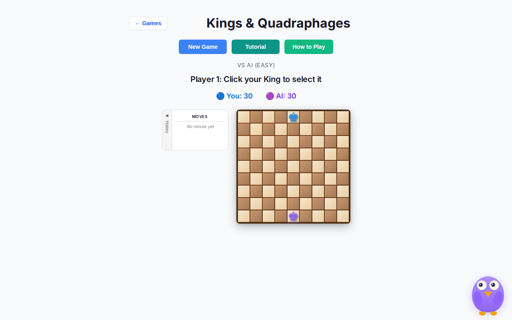
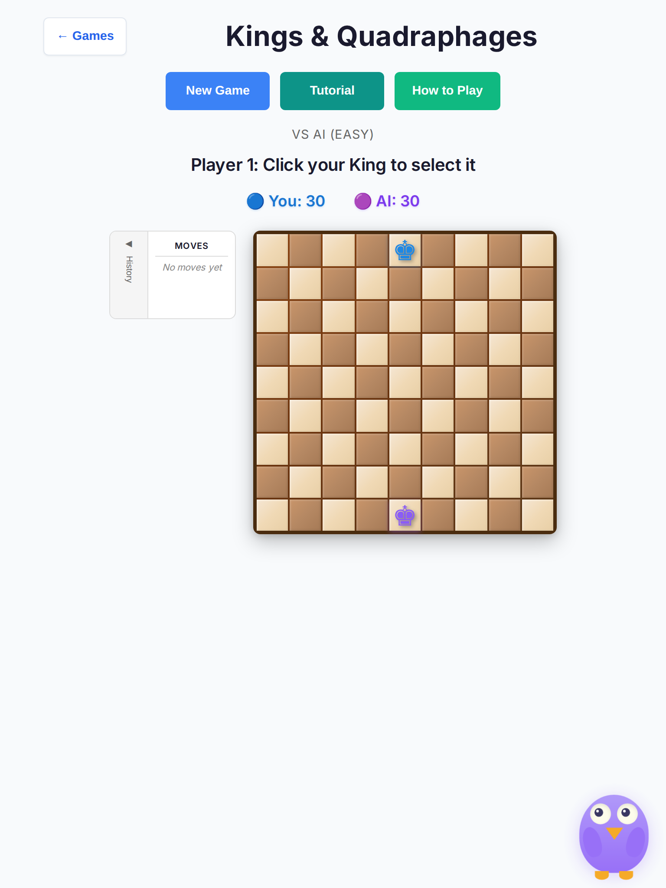
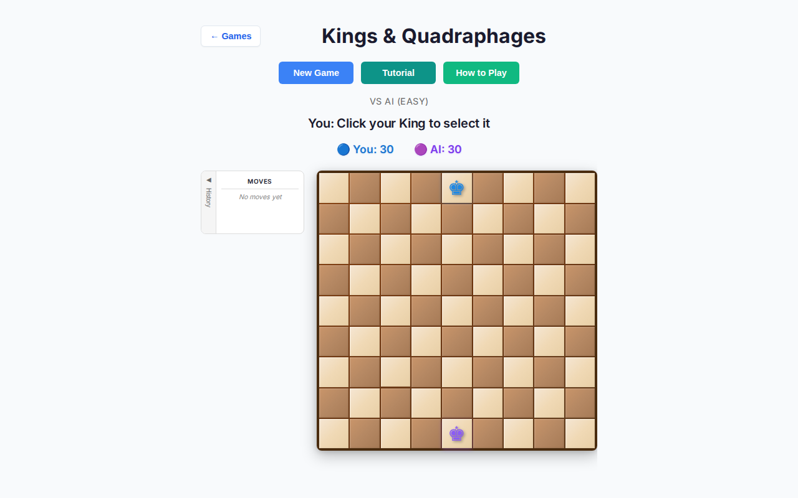
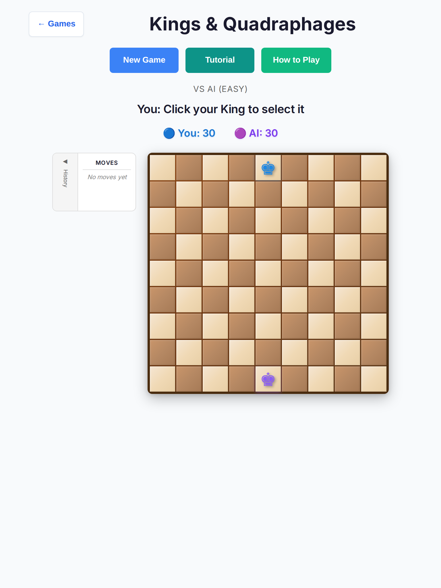
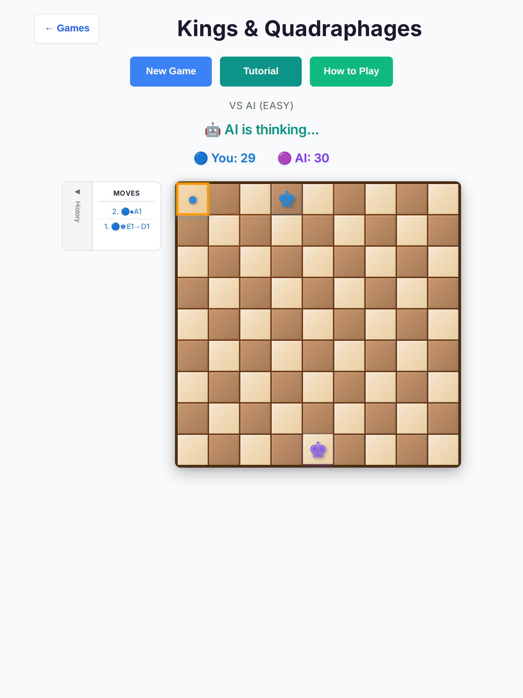
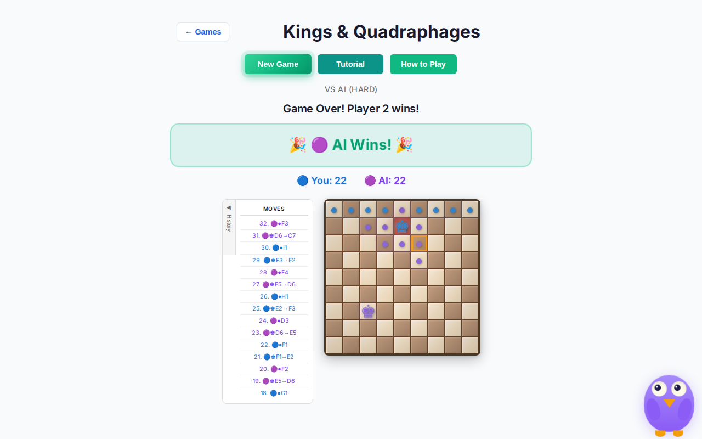
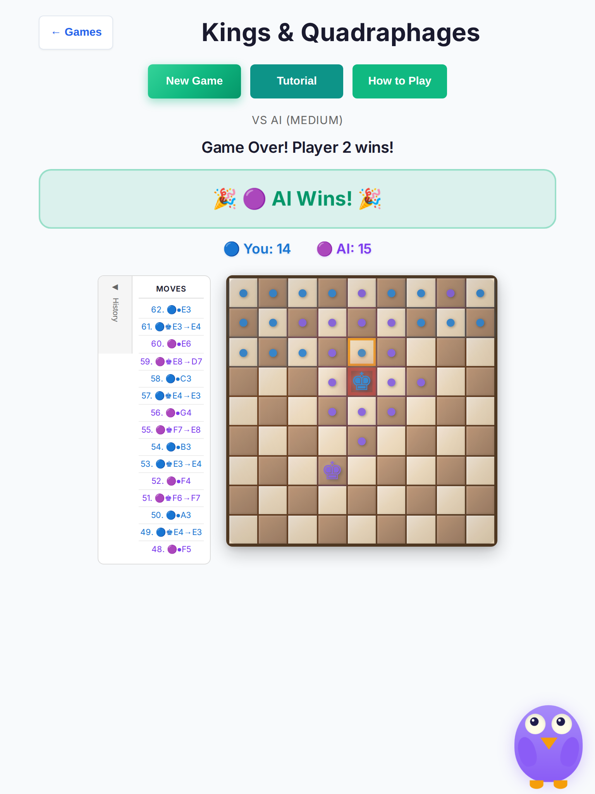

# Kings & Quadraphages — deep playtest (2026-10-07)

Human vs AI deep pass on branch `cursor/overnight-polish-integration-0494` (pre-fix baseline) and re-check after playability fixes. **No rules or scoring changes.**

## Method

| Item | Detail |
| --- | --- |
| Mode | Human vs AI (human opens) |
| Difficulties | Easy / Medium / Hard |
| Viewports | Desktop Chromium 1280×800; tablet Chromium iPad Mini 768×1024 |
| Volume | **10 full games × 3 difficulties × 2 viewports = 60 games** |
| Harness | Headless Playwright; AI think/move `setTimeout` compressed to ≤15ms for volume only (logic unchanged) |
| Checks | End screen, soft-lock, AI think budget, input during `.status-ai-thinking`, unclear copy, cell hit size vs 44px, console/page errors |
| Out of scope | Shared shell/Ollie chrome, clocks, 3D board flag, scoring/rules |

Screenshots: [`docs/playtest/kings-deep-2026-10-07/`](./kings-deep-2026-10-07/).

## Baseline results (60 games, pre-fix)

| Outcome | Count |
| --- | --- |
| Reached end (AI / human / tie / Player-label end chrome) | 57 |
| Soft-lock (harness could not complete a turn) | 3 |
| Timeout / crash | 0 |
| Console / page errors | 0 |

| Cell | Easy | Medium | Hard |
| --- | --- | --- | --- |
| Desktop avg turns | ~29 (mostly supply ties) | ~18 | ~8 (AI traps fast) |
| Tablet avg turns | ~29 | ~18 | ~8 |
| Max measured AI think (compressed delays) | ≤102ms | ≤102ms | ≤96ms |

Cell sizes **before fix:** desktop **29×29**, tablet **36×36** (under 44px WCAG 2.5.5).

### Baseline issues

| # | Finding | Severity | Notes |
| --- | --- | --- | --- |
| 1 | Board cells **29px (desktop) / 36px (tablet)** | high (touch) | Flex shrink-to-fit: `.board { width: min(450px, 100%) }` collapsed beside History |
| 2 | vs-AI status said **“Player 1: …”** while supplies said You/AI | medium (UX) | Kids get mixed identity copy; game-over turn line also said “Player 2 wins!” beside “AI Wins!” |
| 3 | Winner/supply labels assumed human = P1 | medium (UX) | Wrong if `newGameVsAI(..., humanPlaysFirst=false)` / `aiSeat=player1` |
| 4 | Medium AI could **skip a forced win** | medium (AI) | Top-5 random placement pool diluted `+10000` trap scores when `Math.random` was high |
| 5 | Place-phase hint omitted “green square” | low (UX) | Move phase already mentioned green squares |
| 6 | 3 harness “soft-locks” | low (harness) | Incomplete place-phase automation / opening flake — not a controller stall; no console errors; games otherwise finished |

AI input lock: real leaks not confirmed (32 “leaks” in the compressed harness were false positives when the AI finished mid-probe). Manual probe with live delays: history length unchanged while `.status-ai-thinking` visible.

## Fixes (this PR)

Touched only `src/games/kings-quadraphages/*` plus kings tests/docs.

1. **Touch / board size** — `board-ui.ts` adds `.kings-board` + injected CSS using `vw` sizing so the grid does not collapse; coarse/hover-none targets **min(420px)** board ≈ **44×44** cells; `touch-action: manipulation`.
2. **vs-AI copy** — status turn/place/game-over lines use **You/AI**; place phase says “on a green square”.
3. **aiSeat honesty** — winner + supply labels follow `dataset.aiSeat`.
4. **Medium AI** — if any placement scores ≥ 10000 (forced win), random pool is restricted to winning placements only.
5. **Hard AI** — early-return after the first forced-win placement to keep crowded boards snappy (still prefers wins).
6. **Tablet think pause** — coarse/hover-none thinking delay 350ms (desktop remains 500ms); move delay unchanged.

## Post-fix verification

| Check | Desktop | Tablet |
| --- | --- | --- |
| Cell size | **47.3×47.3** | **44×44** |
| Opening status | `You: Click your King to select it` | same |
| Place status | `You: Place a Quadraphage on a green square` | same |
| AI lock during think | no history mutation on spam clicks | same |
| Console errors | none in probe | none |

### Screenshots

| Shot | File |
| --- | --- |
| Desktop before (29px cells, Player 1 copy) |  |
| Tablet before (36px cells) |  |
| Desktop after fix |  |
| Tablet after fix |  |
| Desktop AI thinking |  |
| Tablet AI thinking |  |
| Desktop Hard end |  |
| Tablet Medium end |  |

## Regression tests

- Unit: `tests/unit/kings-deep-playability.test.ts` (You/AI copy, aiSeat labels, injected 44px CSS, Medium win undiluted, coarse think delay)
- E2E: `tests/e2e/kings-deep-playability.spec.ts` (desktop + iPad Mini Chromium — cell size, AI lock, full Easy/Medium finish without Player N end copy)

## Hard stops

- Draft PR only — **do not merge**
- No edits to other open PRs
- No rules / win-detection / supply scoring changes
- No shared `style.css` / shell changes (Kings-local inject only)
