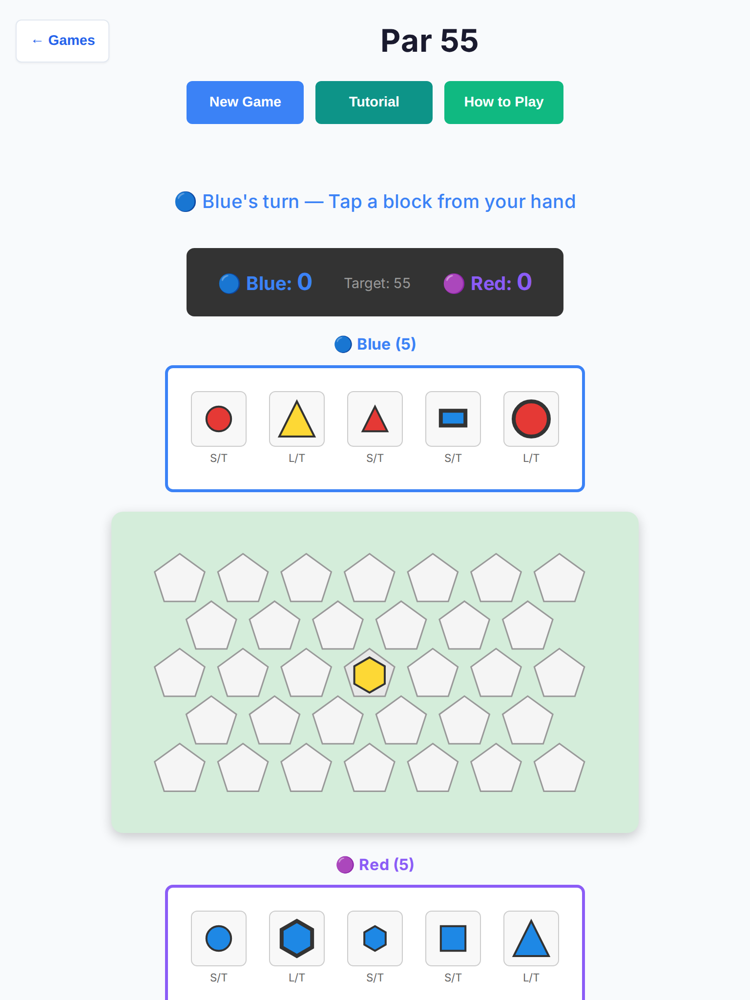
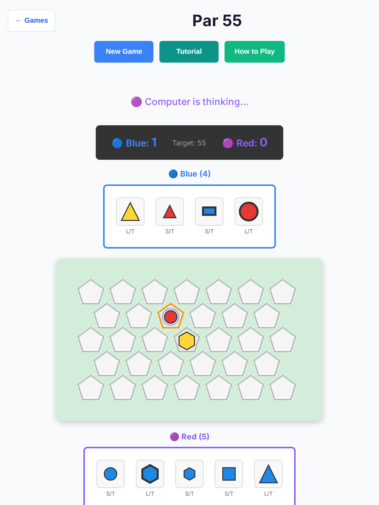
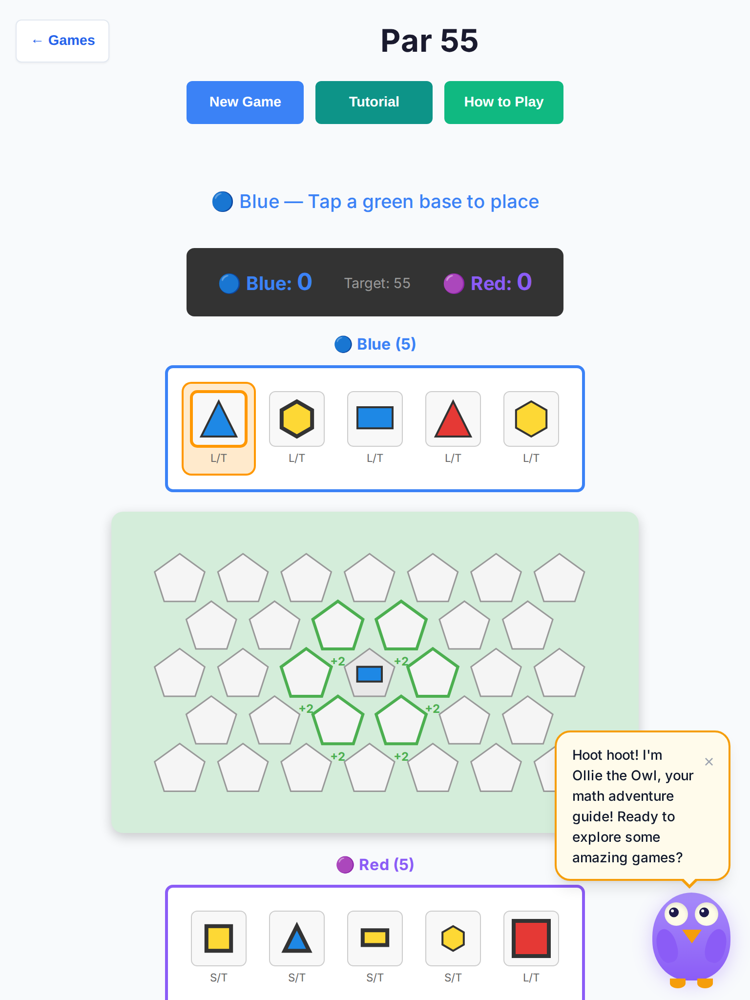
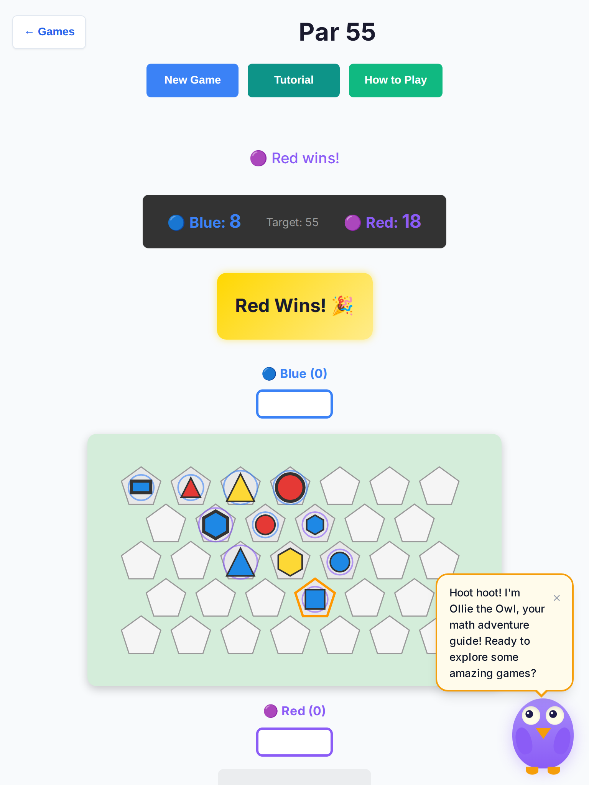
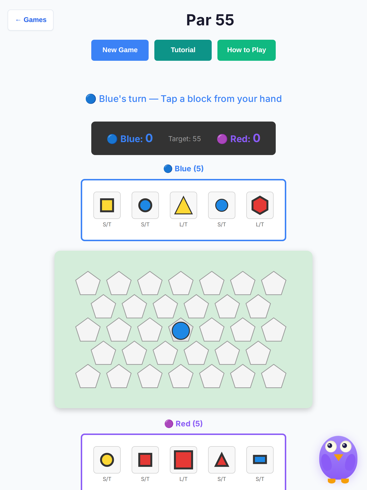
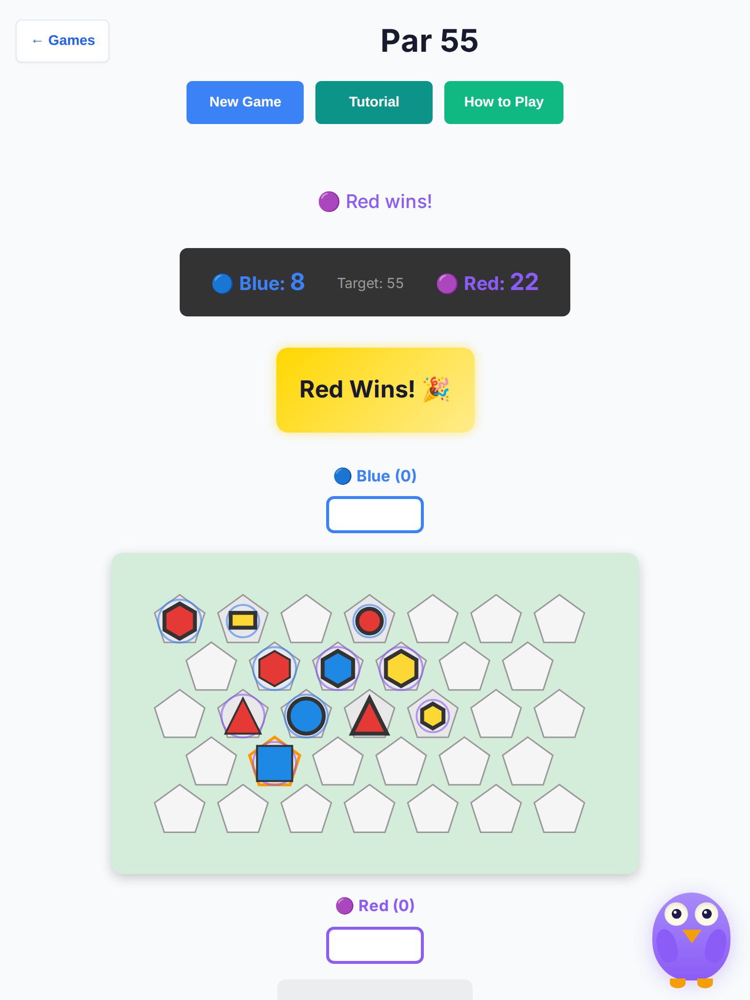
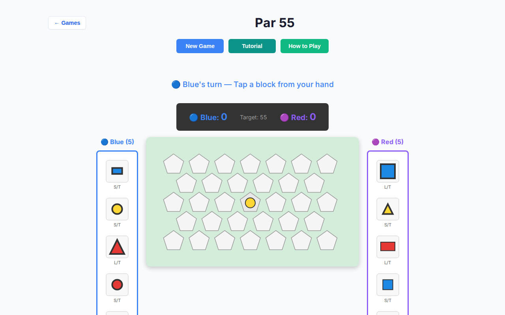
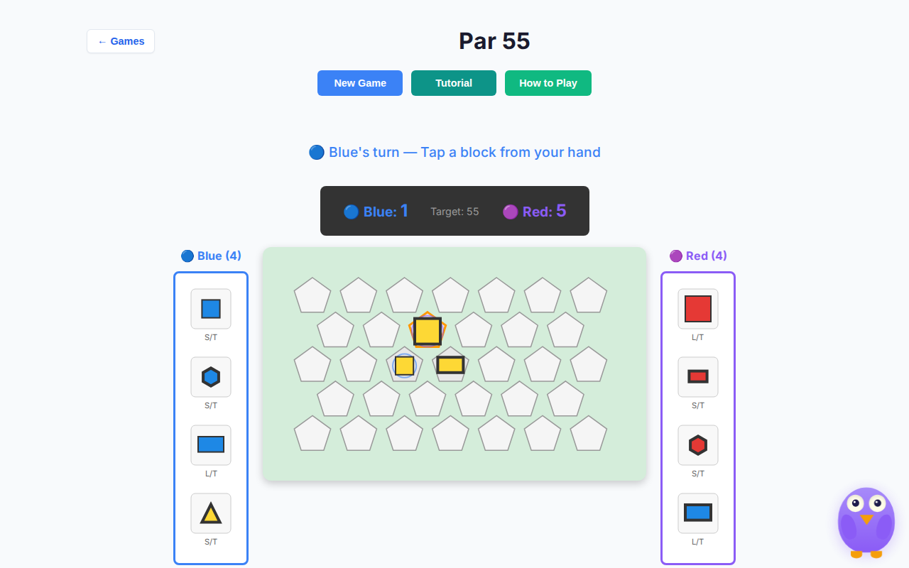
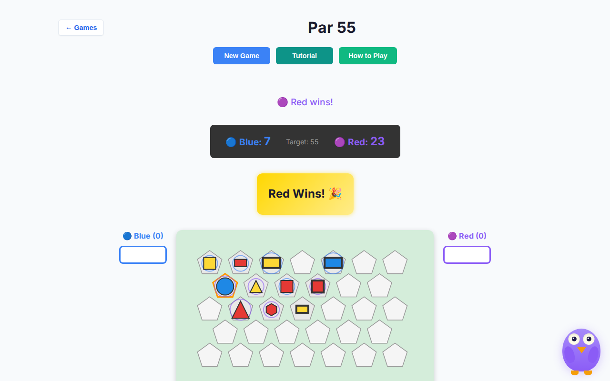

# Par 55 — deep playtest (2026-10-07)

Human vs AI · Easy / Medium / Hard · tablet (768×1024, iPad Mini touch) + desktop (1280×800) · headless Chromium.

**Scope:** playability only — no rules or scoring changes.  
**Harness:** `scripts/par-55-deep-playtest.mjs` · raw data `par-55-deep-2026-10-07/results.json`.  
**Base:** `cursor/overnight-polish-integration-0494`.

## Method

- Local Vite (`127.0.0.1:5173`) + Playwright Chromium headless
- **10 full games × 3 difficulties × 2 viewports = 60 games**
- Each game played until winner / tie banner, stall (15s), or 120 human turns
- Greedy human: first clickable hand block → first valid base (or Pass)
- Also probed **New Game during AI think pause** (stale timer race)
- Captured console errors, page errors, touch metrics, AI think chrome

## Results (post-fix)

| Metric | Value |
| --- | --- |
| Games completed to a winner/tie | **59 / 60** |
| Stalls / turn-budget | **0** |
| New Game race clean | **yes** (`history=0`, Blue select) |
| Console / page errors | **0** |
| Max AI think chrome | **~506 ms** (delay 450 ms) |
| Outcomes | Human 1 · AI 58 · Draw 0 |
| Harness-only flake | 1× tablet/easy#0 artifact `copyfile` EIO (not a game failure; screenshots refreshed) |

### By viewport × difficulty

| Combo | Human | AI | Notes |
| --- | --- | --- | --- |
| tablet / easy | 1 | 8 (+1 harness flake) | Short ~4-turn settles |
| tablet / medium | 0 | 10 | |
| tablet / hard | 0 | 10 | |
| desktop / easy | 0 | 10 | Side-hands hittable after overflow fix |
| desktop / medium | 0 | 10 | |
| desktop / hard | 0 | 10 | |

Greedy first-block bots lose quickly to Red’s attribute-match scoring — full legal games, not stalls.

## Bugs found & fixed

### 1. Critical — AI timer race after New Game

**Symptom:** Starting New Game while “Computer is thinking…” left a stale `setTimeout` that kept mutating the board (`history` non-zero on a fresh match). `makeAIMove` also lacked a seat guard, so a late callback could `passTurn` for Blue when `getAIMove` returned null.

**Fix (`game-controller.ts`):** Single clearable `aiTimer` + `aiGeneration` bump on `initGame` / `newGame`; `scheduleAI`; hard `isComputerTurnPending` guard at the top of `makeAIMove`.

**Regression:** `tests/unit/par-55-ai-timer-race.test.ts`, e2e New Game race.

### 2. High — Desktop side-hands not hittable

**Symptom:** On 1280×800, Blue/Red hands sit outside `#app`’s 700px column. `#app { overflow-x: clip }` made `elementFromPoint` return `#main-content` — real mouse clicks never reached hand tiles (tablet column layout was fine).

**Fix (`board-ui.ts`):** When Par 55 is mounted, `#app:has(.par55-board)` widens to `min(1100px, 100%)` with `overflow-x: visible`.

### 3. Medium — Touch floors / base hit area

**Pre-fix:** Pentagon bbox ~48×45; no dedicated hit target.

**Post-fix:**

| Target | Tablet | Desktop |
| --- | --- | --- |
| Hand blocks | **72×92** | **68×88** |
| Bases (group) | **51×49** | **51×49** |
| Valid hit circle | r=22 (44px) | r=22 |
| Pass / Clear buttons | min **44×44** | min **44×44** |

### 4. Medium — Slow AI pause

**Pre-fix:** 800 ms think → ~860 ms chrome.  
**Fix:** `AI_THINK_DELAY_MS = 450` (observed max ~506 ms).

### 5. Low — Confusing turn copy

**Fix:** Tap-oriented status (“Tap a block from your hand” / “Tap a green base to place”); `.par55-turn-hint` when Pass is the only escape; `.status-ai-thinking` class while the computer seat is pending.

## Observations (not changed — rules / scoring)

- First-to-55 with greedy human vs even Easy AI ends in few plies; difficulty ranking is noisy for this bot. No scoring formula changes.
- Winner banner still uses celebration glyphs (pre-existing chrome).
- Desktop board pentagons remain SVG (not CSS grid cells); hit circle covers the 44px floor.

## Screenshots

| Scene | File |
| --- | --- |
| Tablet Easy start |  |
| Tablet Easy mid / AI |  |
| Tablet placing |  |
| Tablet Easy end |  |
| Tablet Medium New Game race |  |
| Tablet Hard end |  |
| Desktop Easy start |  |
| Desktop Medium mid |  |
| Desktop Hard end |  |

## Tests added / updated

- `tests/unit/par-55-ai-timer-race.test.ts`
- `tests/unit/par-55-deep-playtest-ux.test.ts`
- `tests/e2e/par-55-playability.spec.ts`
- Overnight status exact strings updated for tap copy
- `scripts/par-55-deep-playtest.mjs`

## Files touched

- `src/games/par-55/{game-controller,board-ui}.ts`
- Par 55 unit/e2e tests + playtest docs/script only (no other games)
- **No** `rules.ts` / scoring / win-condition edits

## Hard stops honored

- No merges; did not edit or close other PRs
- Draft PR only, base `cursor/overnight-polish-integration-0494`
