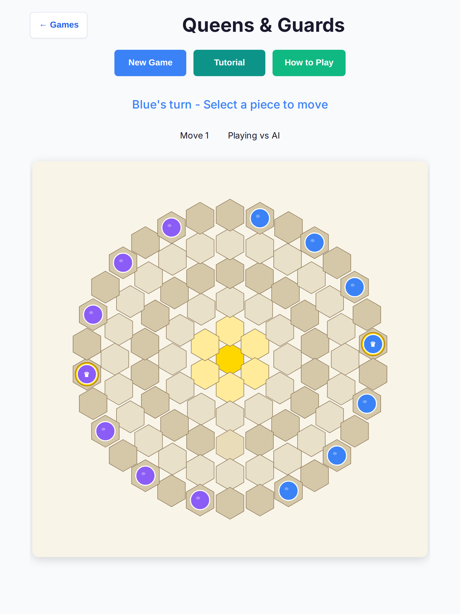
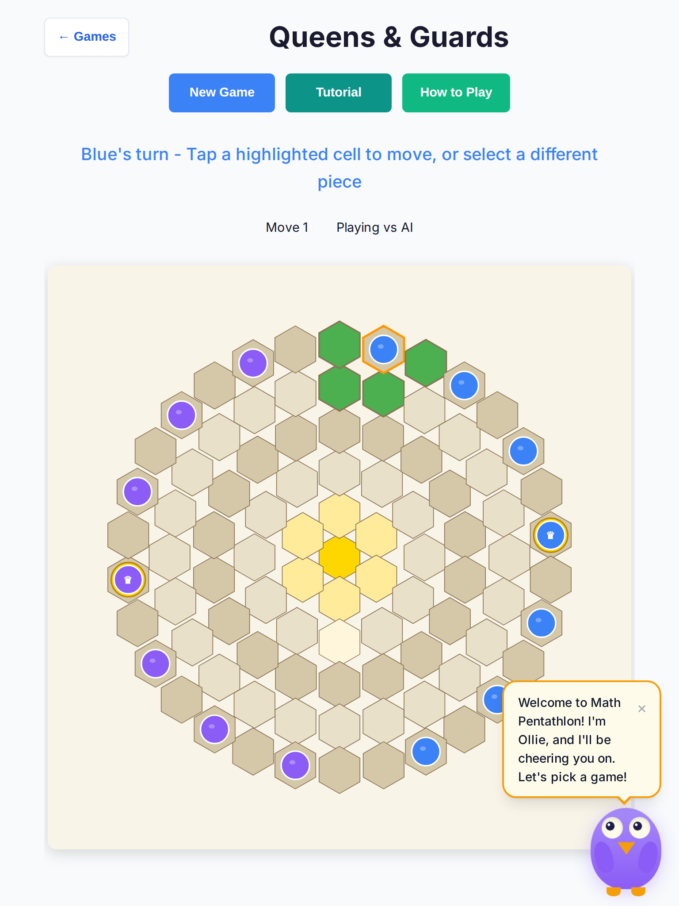
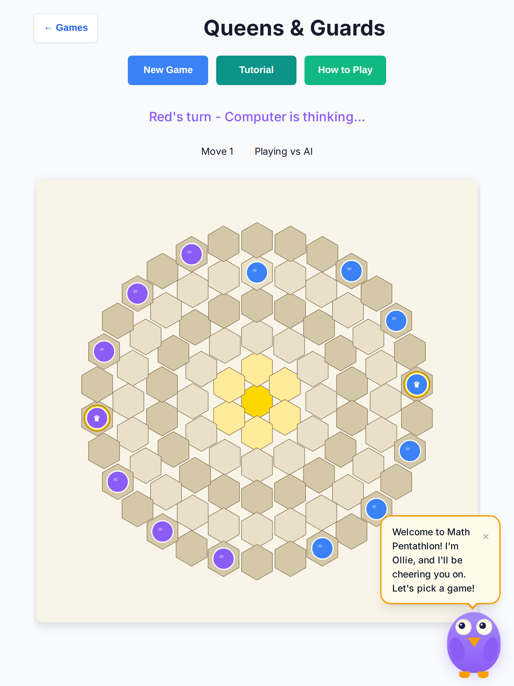
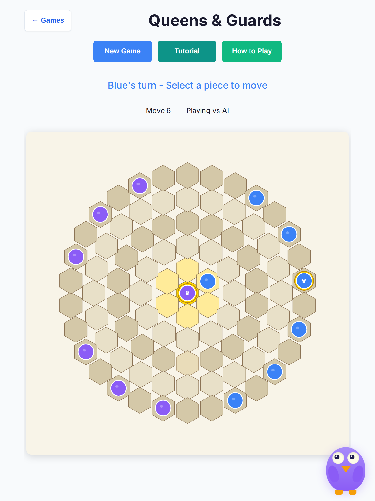
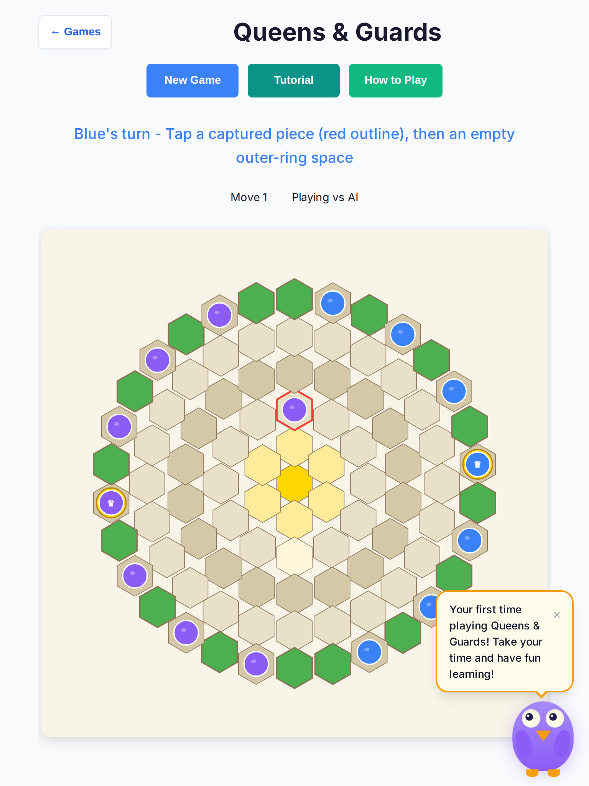
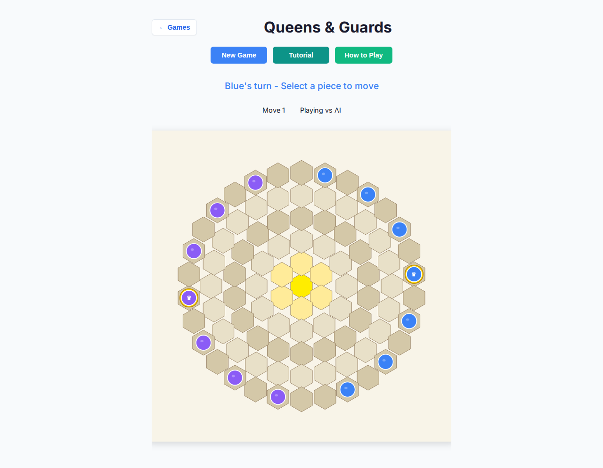
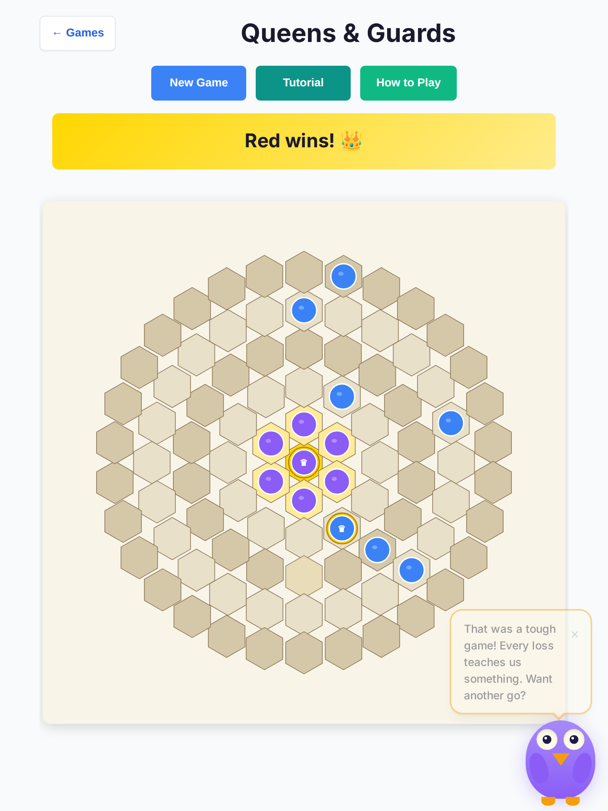

# Queens & Guards — deep playtest (2026-10-07)

Human vs AI · Easy / Medium / Hard · tablet (768×1024, touch) + desktop (1280×800) · headless Chromium.

**Scope:** playability only (UX, touch, AI latency/stalls, console). **No rules or scoring changes.**

## Method

- Local Vite (`npm run dev`) + Playwright Chromium headless
- 10 full games × 3 difficulties × 2 viewports = **60 games**
- Random-legal Blue mover; Red = stock AI worker with play budgets (Easy 800ms / Medium 1500ms / Hard 2500ms)
- Metrics: outcome, human turns, AI think wall time, hex CSS hit size, console/page errors
- Serial recheck of every prior stall/error bucket (5/5 wins, 0 errors)

## Headline results (after fixes)

| Bucket | Games | Outcomes | Think median (of medians) | Hex path min (CSS px) | Console errors |
| --- | --- | --- | --- | --- | --- |
| tablet / easy | 10 | 10 red-win | ~590ms | 46.2×53.4 | 0 |
| tablet / medium | 10 | 10 red-win | ~1685ms | 46.2×53.4 | 0 |
| tablet / hard | 10 | 8 red-win, 2 ai-stall* | ~2694ms | 46.2×53.4 | 0 |
| desktop / easy | 10 | 7 red-win, 2 ai-stall*, 1 harness-error* | ~580ms | 46.2×53.4 | 0 |
| desktop / medium | 10 | 10 red-win | ~1688ms | 46.2×53.4 | 0 |
| desktop / hard | 10 | 10 red-win | ~2693ms | 46.2×53.4 | 0 |

\*Parallel-load harness artifacts (12s AI wait under 4-way concurrency / blank first paint). **Serial recheck of those buckets: 5/5 full wins, 0 stalls, 0 console errors.**

- **Global think max:** 3219ms (Hard, within 2500ms search + paint/restore pauses)
- **Games with cells &lt;44px after fix:** 0
- **Page/console errors across 60 games:** none

Raw JSON: [`results.json`](./queens-guards-deep-2026-10-07/results.json)

## Findings → fixes

### 1. Critical — hex tap targets ~21×24px (FIXED)

SVG used `width/height: 100%` without an intrinsic size, so the board collapsed to the browser’s **300×300** replaced-element default. Hex paths measured **~21×24 CSS px** on both tablet and desktop.

**Fix:** give `.qg-board` an intrinsic viewBox size, pin CSS width at **660px** (scale ≈0.83 → path **≈46×53**), allow short horizontal scroll in `.qg-game-area`. Styles live in `injectQGStyles()` (game-local).

### 2. High — AI-seat status invited human taps (FIXED)

During the paint delay before `isAIThinking`, status showed **“Red’s turn — Select a piece to move.”** Board was already input-locked, but the copy was wrong for kids/AT.

**Fix:** any computer seat (vs AI + Red to move) shows **“Computer is thinking…”** + `.status-ai-thinking`, even before the worker starts.

### 3. Medium — AI-seat aria honesty (FIXED)

While Red thinks, cells now set `aria-disabled="true"`, append `not available`, and omit `valid move` highlights.

### 4. Medium — restore / move copy (FIXED)

Status + tutorial use tap-friendly wording; restore prompt mentions the red outline and outer-ring target.

### 5. Low — AI paint latency (FIXED)

Think paint delay 500→250ms; restore-chain pause 400→280ms. Search budgets unchanged.

### 6. Observed — parallel-load stalls (NOT a product bug)

Four concurrent Chromium contexts + Hard search occasionally exceeded a 12s harness wait or blanked first paint. Serial replay of those buckets completed cleanly. No product soft-lock found after the AI-seat chrome fix.

### 7. AI strength / slowness

- Easy ~0.5–0.6s, Medium ~1.7s, Hard ~2.7s median think — on budget.
- Random Blue never beat Red in this pass (expected). No illegal AI moves or mid-game freezes in completed games.

## Screenshots

| Shot | File |
| --- | --- |
| Tablet start (after fix) |  |
| Piece selected + legal highlights |  |
| AI thinking chrome |  |
| Mid-game |  |
| Capture restore prompt |  |
| Tablet Easy start (suite) |  |
| Desktop Easy start (suite) |  |
| Game over (tablet Easy) |  |

## Regression tests

- Unit: `tests/unit/queens-guards-touch-aria-playability.test.ts` (660px pin, aria lock, tap copy, paint delay)
- E2E: `tests/e2e/queens-guards-playability.spec.ts` (44px tablet cells, AI-seat aria, Easy full game)
- Existing soft-lock / play-deadline suites still green

## Verification run

- `eslint src/games/queens-guards` — clean
- `tsc --noEmit` — clean
- Queens unit suites — passed
- `playwright test tests/e2e/queens-guards-playability.spec.ts --project=chromium` — 3 passed
