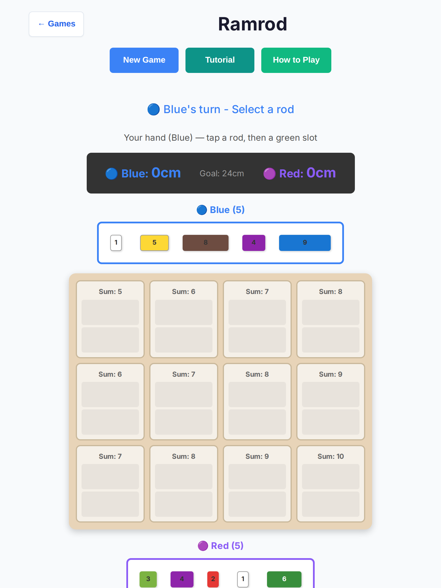
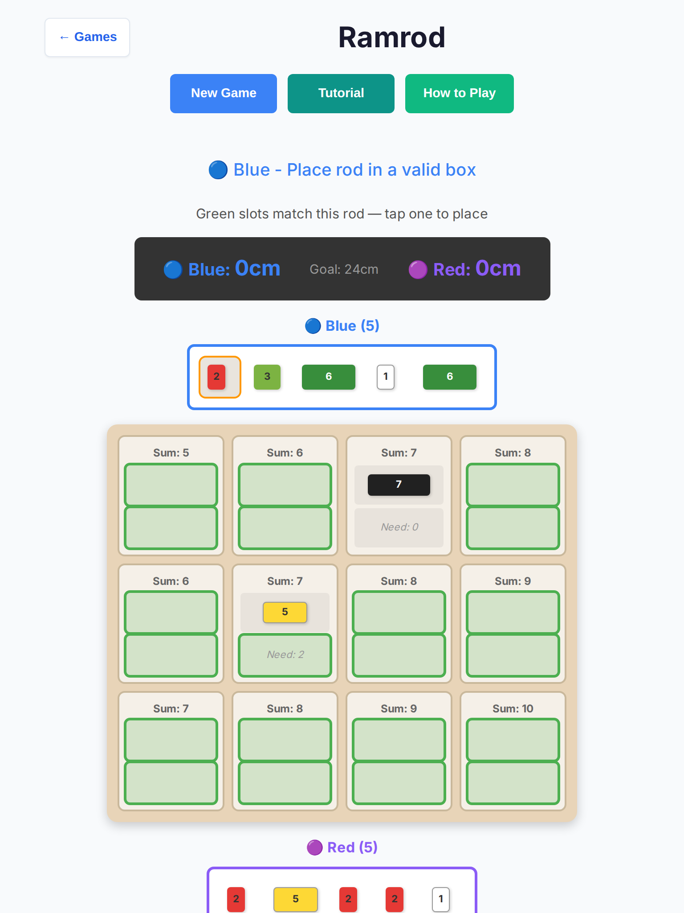
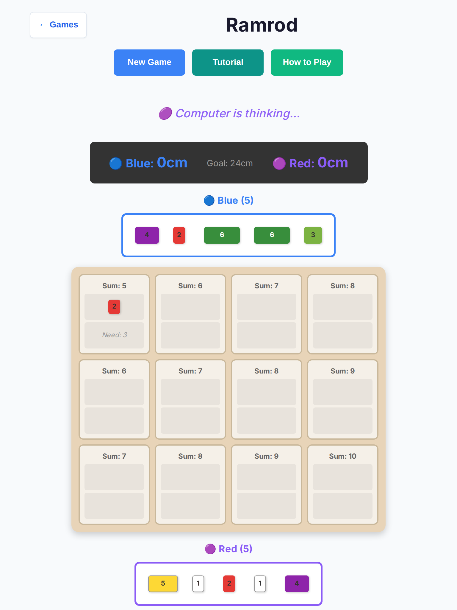
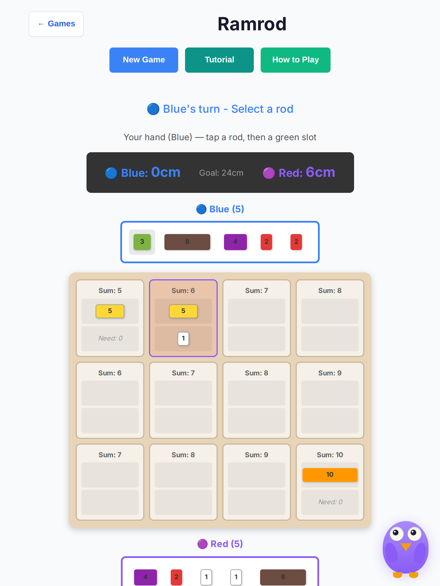
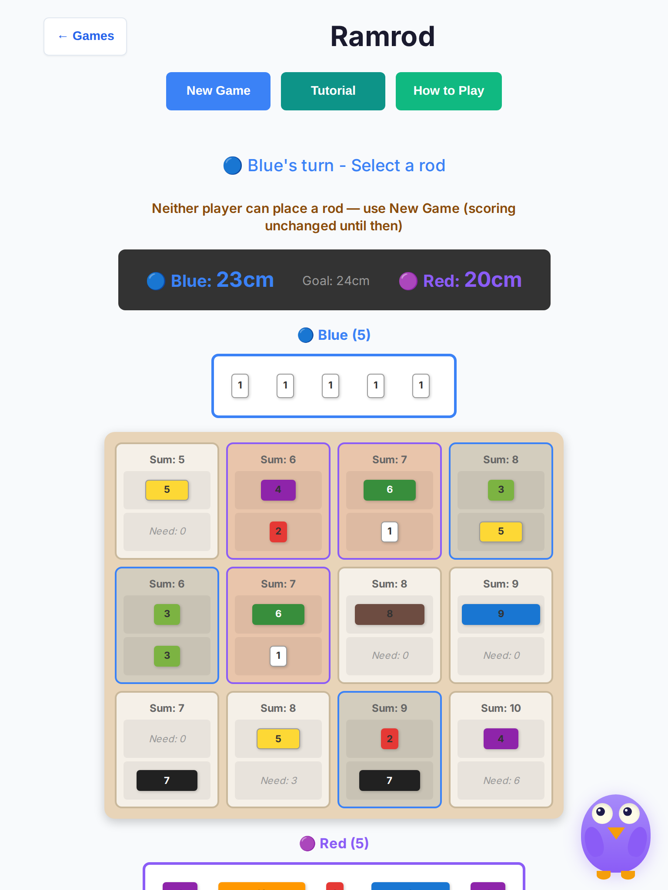
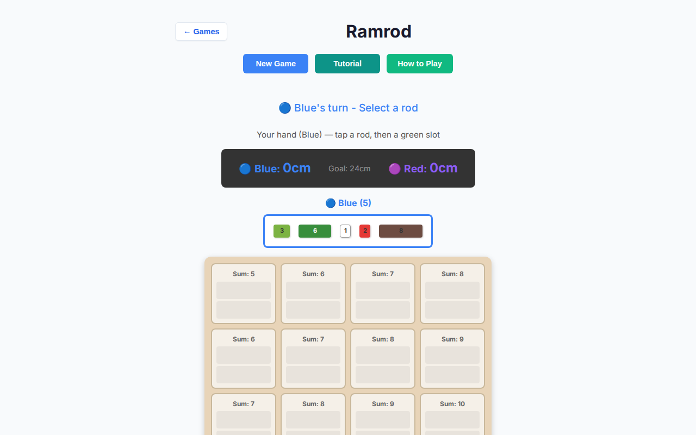
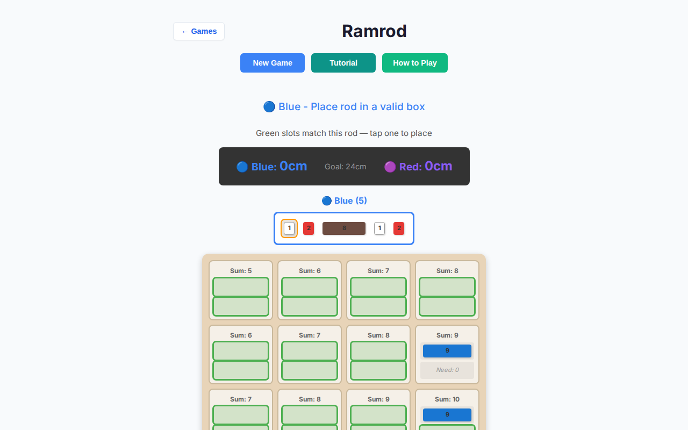
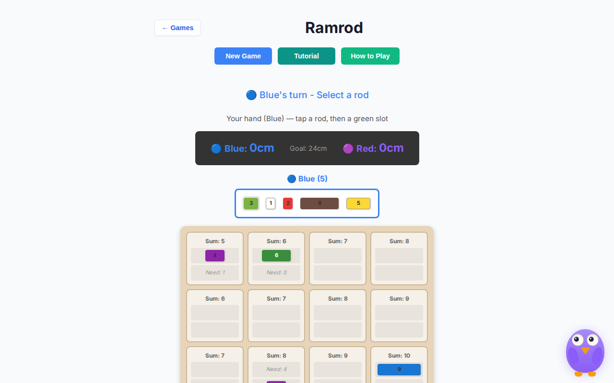
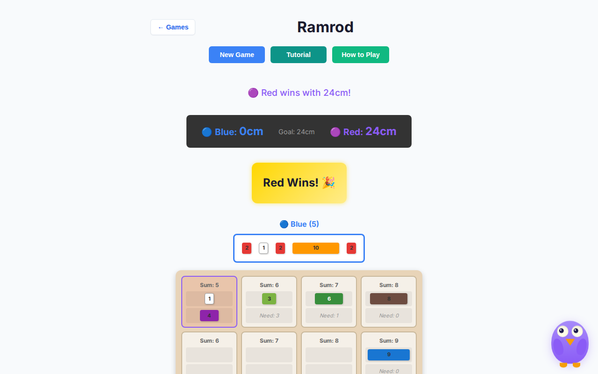

# Ramrod — deep playtest (2026-10-07)

Human vs AI · Easy / Medium / Hard · tablet (768×1024, iPad Mini touch) + desktop (1280×800) · headless Chromium.

**Scope:** playability only — no rules or scoring changes.  
**Harness:** `scripts/ramrod-deep-playtest.mjs` · raw data `ramrod-deep-2026-10-07/results.json`.  
**Base:** `cursor/overnight-polish-integration-0494`.

## Method

- Local Vite (`127.0.0.1:5173`) + Playwright Chromium headless
- **10 full games × 3 difficulties × 2 viewports = 60 games**
- Each game played until winner banner / tie, mutual-place deadlock hint, stall (12s), or 80 human turns
- Greedy human: prefer mid-length rods + completing (“Need:”) slots; Pass when stuck
- Captured console errors, page errors, illicit AI pass on Blue, touch metrics, AI “thinking” sightings

## Results (post-fix)

| Metric | Value |
| --- | --- |
| Games run | **60 / 60** |
| Finished (human or AI win) | **56** |
| Mutual-place deadlock (rules residual) | **2** |
| Turn-budget (greedy bot no progress) | **2** |
| Illicit Blue pass / stolen seat | **0** |
| Console / page errors | **0** |
| Outcomes | Human 2 · AI 54 · Deadlock 2 · Turn-budget 2 |
| AI think pause (observed) | **615–631ms** (target 550ms schedule) |

### By viewport × difficulty

| Combo | Human | AI | Deadlock | Turn-budget |
| --- | --- | --- | --- | --- |
| tablet / easy | 1 | 8 | 1 | 0 |
| tablet / medium | 0 | 10 | 0 | 0 |
| tablet / hard | 0 | 9 | 0 | 1 |
| desktop / easy | 1 | 8 | 0 | 1 |
| desktop / medium | 0 | 10 | 0 | 0 |
| desktop / hard | 0 | 9 | 1 | 0 |

AI think UI (`.ramrod-computer-thinking` / “Computer is thinking…”) observed on handoffs (`think≥1` on finished games). Max AI pause stayed under ~0.65s after the 550ms schedule.

## Bugs found & fixed

### 1. Critical — AI timer race could pass Blue’s seat

**Symptom:** Every `updateUI` scheduled `setTimeout(makeAIMove, 800)`. Stacked timers + `getAIMove` returning `null` when seat ≠ AI still called `passTurn` → illicit pass / stolen turn.

**Fix (`game-controller.ts`):** Single clearable `aiTimer` (Prime Gold pattern), `scheduleAI` / `clearAiTimer`, hard `isComputerTurnPending` guard; pass only when AI seat is truly out of moves. Think delay **800 → 550ms**.

**Regression:** `tests/unit/ramrod-ai-timer-race.test.ts`, updated `ramrod-ai-input-guard.test.ts`.

### 2. Critical — Desktop hands unclickable (overflow clip)

**Symptom:** Horizontal Blue | Board | Red layout was ~870px wide while `#app` is max-width **700px** with overflow clip. Hands painted left of `#app`; `elementFromPoint` hit `<main>` — Playwright and real clicks never reached rods. Tablet column layout worked.

**Fix (`board-ui.ts`):** Always stack hands + board in a column inside `max-width: 100%`; wrap hand rods in a row; slightly fluid box widths.

### 3. High — Touch targets under 44px (tablet)

**Post-fix tablet measures:**

| Target | Tablet | Desktop (fine pointer) |
| --- | --- | --- |
| Hand rods | **44×44** (min) | ~28–68 × 32 |
| Board slots | **100×44** | 100×32 |
| Pass / Clear | **≥44** height | **≥44** height |

Coarse / `max-width: 900px` media query enlarges slots, rod wrappers, and buttons. Valid slots get a green outline. Desktop mouse path left smaller (same residual pattern as Sum Dominoes cells).

### 4. Medium — Confusing turn / stuck UX

**Fix:** Secondary `.ramrod-turn-hint` under locked overnight status strings (`Blue's turn - Select a rod`, `Place rod in a valid box`). Tap selected rod again to clear. Deadlock hint when **neither** seat has a legal placement (does not change scores — prompts New Game). `ramrod-computer-thinking` class + reduced-motion on winner glow.

## Observations (not changed — rules / scoring)

- **Mutual-place deadlock:** Both players can still hold rods that fit no remaining box slots. Engine only auto-ends on target score or both hands empty. Infinite Pass was possible; we surface a deadlock hint only. Settling on mutual inability would be a **rules** change — not applied.
- **Turn-budget (2/60):** Greedy harness failed to progress while status remained “Select a rod” (no console errors, no illicit AI pass). Not reproduced as a deterministic controller soft-lock; treated as bot limitation + possible late-game fit scarcity.
- **AI strength vs greedy bot:** Hard/Medium dominate (expected). Easy is still strong when the bot places greedily.
- Locked status strings intentionally unchanged for overnight exact-seat tests.

## Screenshots

| Scene | File |
| --- | --- |
| Tablet start (vs AI) |  |
| Tablet placing + hint |  |
| Tablet AI thinking |  |
| Tablet medium mid |  |
| Tablet easy end |  |
| Desktop start |  |
| Desktop placing hint |  |
| Desktop easy mid |  |
| Desktop hard end |  |

## Tests added

- `tests/unit/ramrod-ai-timer-race.test.ts`
- `tests/unit/ramrod-deep-playability.test.ts` (hints, deselect, CSS floors, 12× scripted Easy/Med/Hard finishes)
- `tests/e2e/ramrod-deep.spec.ts` (desktop ×3 difficulties + tablet touch floors)

## Files touched

- `src/games/ramrod/{game-controller,board-ui}.ts`
- Tests / docs / `scripts/ramrod-deep-playtest.mjs` only (no other games)
