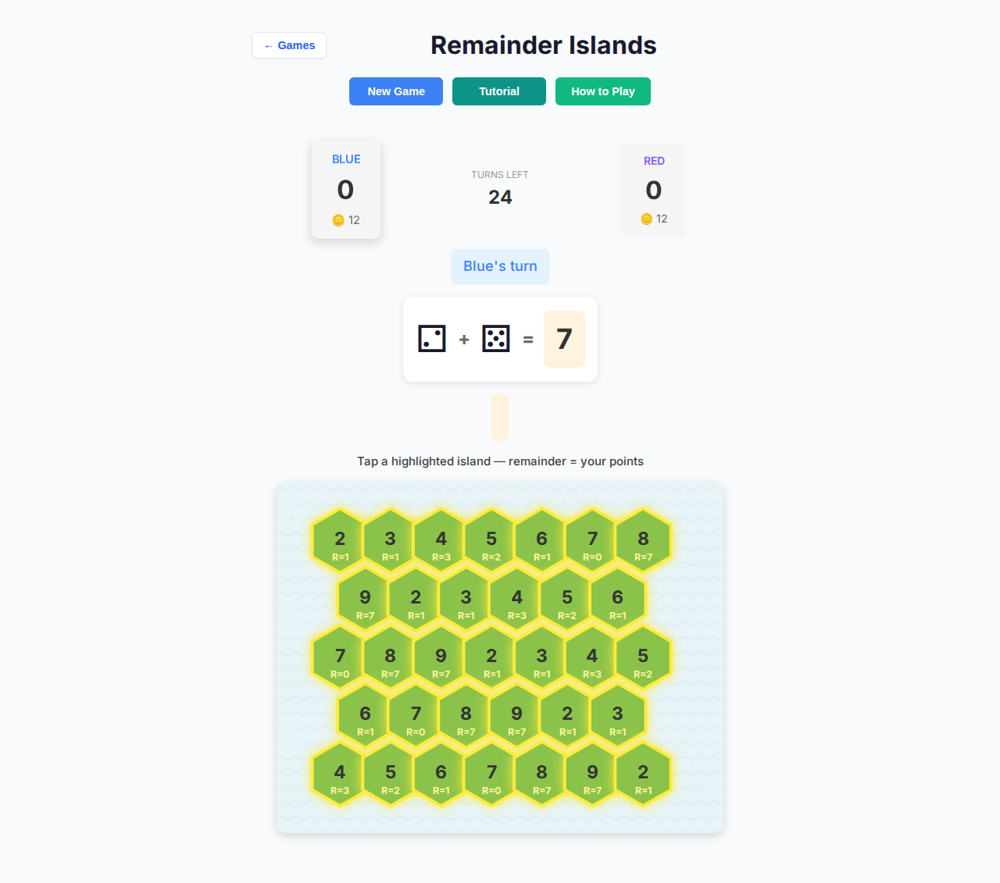
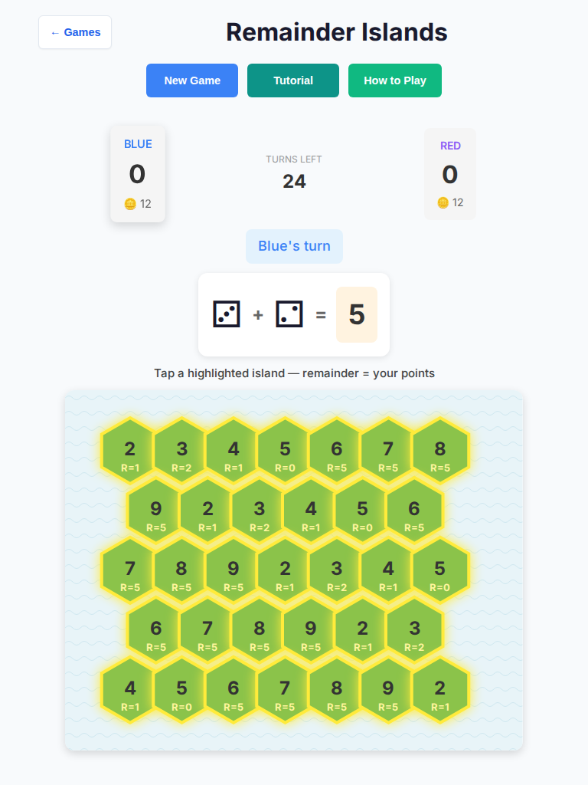
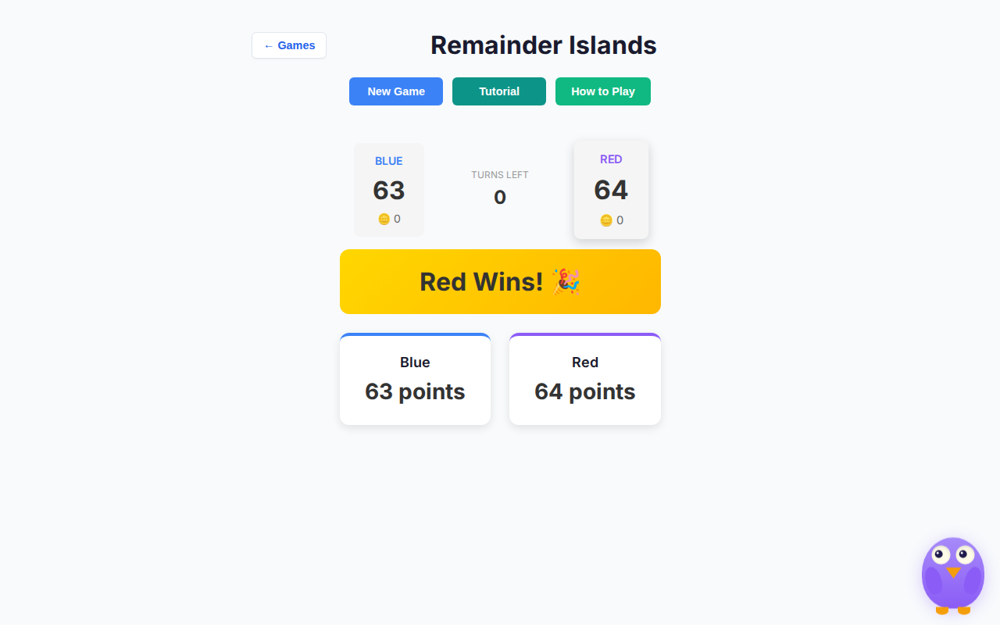
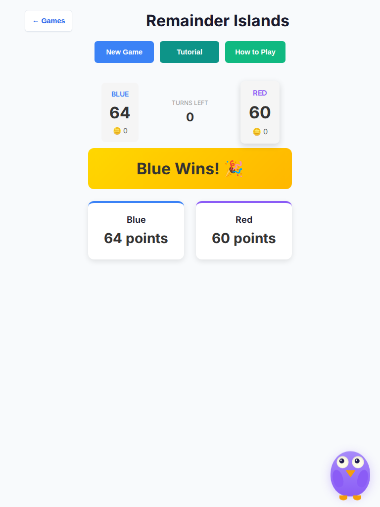

# Remainder Islands — Deep Playtest (2026-10-07)

Human vs AI · Easy / Medium / Hard · Desktop + tablet headless Chromium · **10 full games each** (60 matches total).

Screenshots: [`screenshots/remainder-islands-deep-2026-10-07/`](./screenshots/remainder-islands-deep-2026-10-07/)

## Method

- Autopilot human: always tap the valid island with the highest `R=` hint (max-remainder).
- AI seat: Red (player2), Easy / Medium / Hard via New Game modal.
- Viewports: desktop `1280×800` (mouse) and tablet `768×1024` (`hasTouch`).
- Harness: `tests/e2e/remainder-islands-deep-playtest.spec.ts` (Chromium-only).
- Unit sims: `tests/unit/remainder-islands-deep-playtest.test.ts` (12 matches × 3 difficulties, no DOM timers).

**No rules or scoring formula changes.** Fixes target stalls, AI orchestration races, touch clarity, and control sizing.

## Results summary

| Viewport | Easy (Blue W–L–D) | Medium | Hard | Console errors |
| -------- | ----------------- | ------ | ---- | -------------- |
| Desktop  | 6–3–1             | 5–4–1  | 8–0–2 | **0**         |
| Tablet   | 6–4–0             | 7–3–0  | 4–5–1 | **0**         |

- All **60** matches reached `.remainder-game-over` (no stalls / soft-locks).
- JSON dumps: `summary-desktop.json`, `summary-tablet.json` alongside screenshots.
- Wall clock: ~15.4 minutes for the Chromium deep e2e file.

Blue = human (first seat). Red = computer. Hard series still swing with dice; max-remainder human + first-player seat is a strong baseline.

## Findings → fixes

| Finding | Severity | Fix |
| ------- | -------- | --- |
| Skip with no open islands could burn `turnsRemaining` to 0 without entering `gameOver` → endless rolling | **Stall / P0** | `performRoll` ends the match and crowns the score leader when a skip exhausts turns (`rules.ts`) |
| Pending `setTimeout` AI callbacks survived New Game / remount → ghost moves | **Race / P1** | Clear AI timer + `aiGeneration` guard on `initGame` / `newGameVs*` (`game-controller.ts`) |
| AI think felt slow at 800ms×2 per computer turn | **Pacing / P2** | Delays → 450ms roll / 550ms select (`getAIThinkDelays`) |
| Touch users never saw hover preview → remainder opaque until commit | **UX / P1** | Static `R=` hints on every valid island during selection; hide under selected preview |
| Empty division-preview shell left a blank orange gap before first hover | **UX / P2** | Mount preview only when `selectedIsland` is set; `:empty { display: none }` |
| Roll / primary controls lacked coarse-pointer floor; board could overflow narrow widths | **Touch / P2** | `min-height: 48px` under `@media (pointer: coarse)`, `touch-action: manipulation`, board `max-width: 100%` |
| Select copy said only “Select an island…” | **UX / P3** | “Tap a highlighted island — remainder = your points” |
| Hard AI occasionally sampled weaker top-3 moves even when remainders differed | **AI / P3** | Remainder weight + sort tie-break in `evaluateMoves` (no scoring-rule change) |

## Screenshots

### Selection UX (R= hints + tap instruction)

### Game over (sample)

Additional per-difficulty select + g1/g10 game-over shots live in the same folder.

## Regression coverage

- **Unit:** skip→gameOver, AI timer cleanup, R= hints, coarse CSS, empty-preview absence, 12× Easy/Medium/Hard sims, controller fake-timer full match.
- **E2E:** 10×3×2 Chromium full matches with console-error assertions and artifact screenshots.

## Verification run (this agent)

- `npm run lint` — pass
- `npx tsc --noEmit` — pass
- `npx vitest run tests/unit/*remainder*` — 50 files / 120 tests pass
- `npx playwright test tests/e2e/remainder-islands-deep-playtest.spec.ts --project=chromium` — 2 passed (~15.4m)

## Out of scope / deferred

- Game-over still hides the board and repeats scores in two chrome bands (pre-existing shell layout).
- Help copy still frames “divide total by island value” for learners who invert dividend/divisor — content polish only; not changed here.
- No production deploy / alpha→main promotion.
