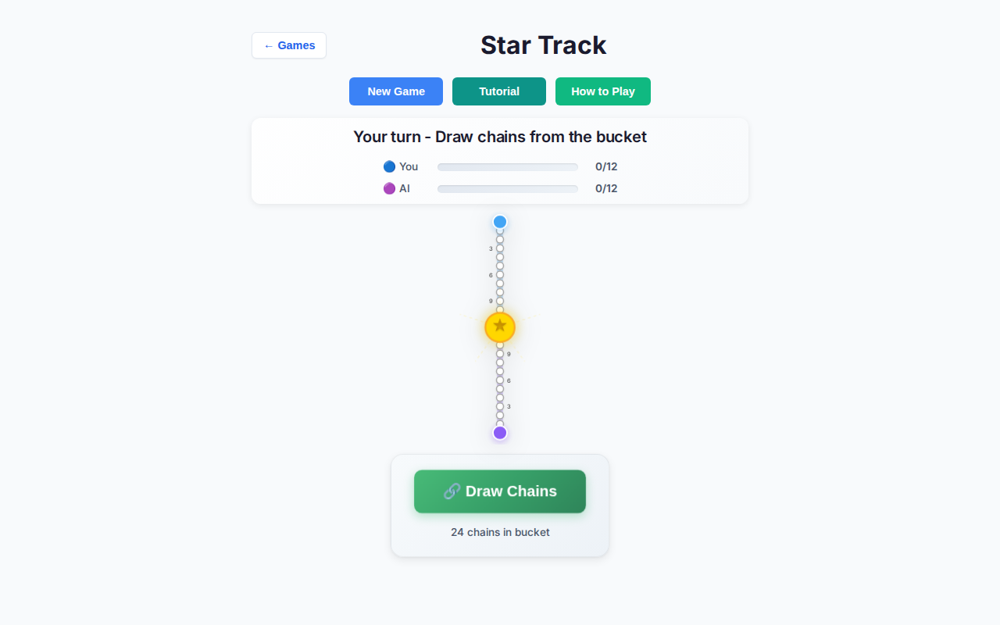
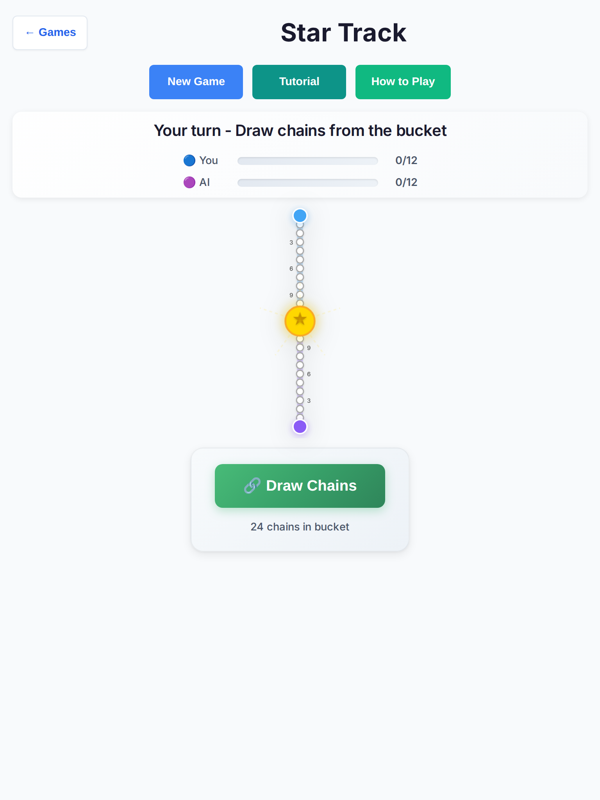
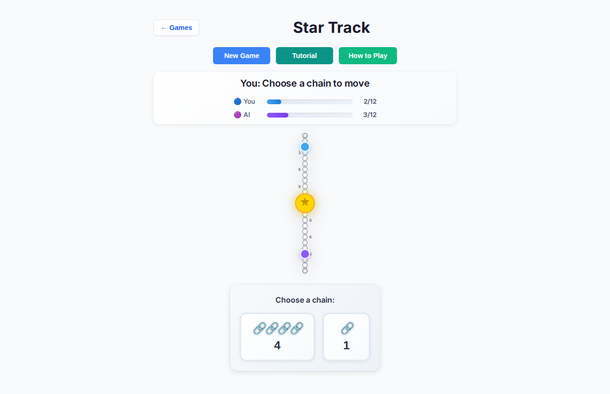
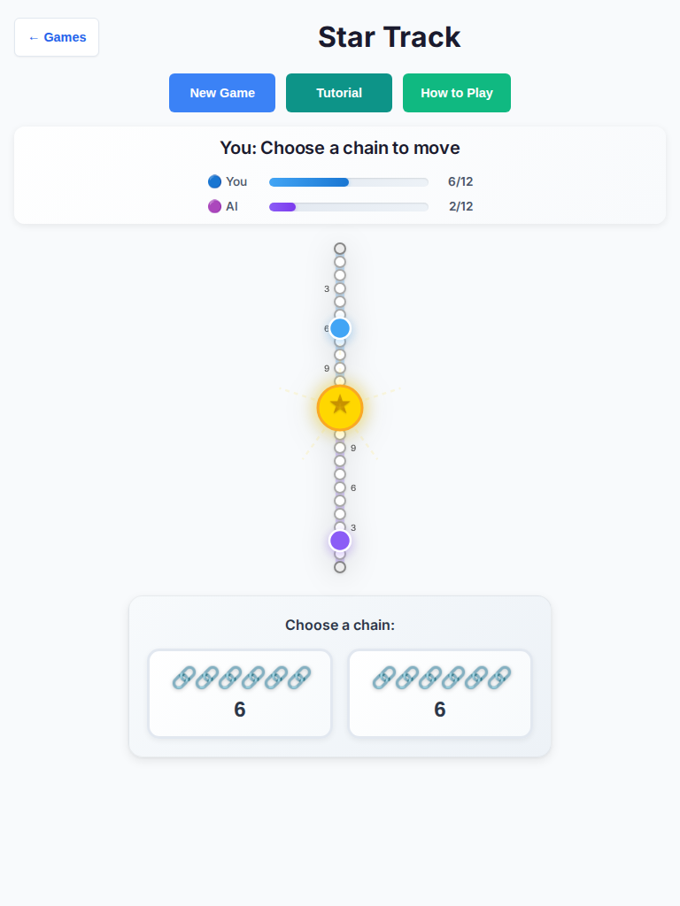
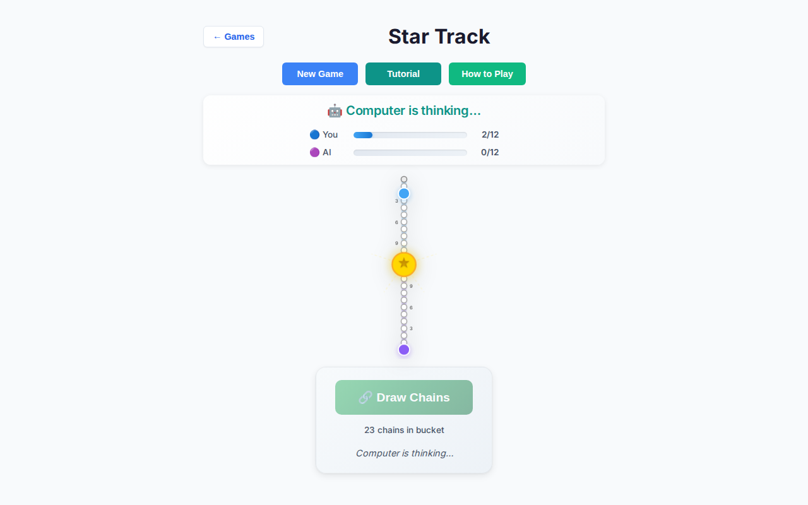
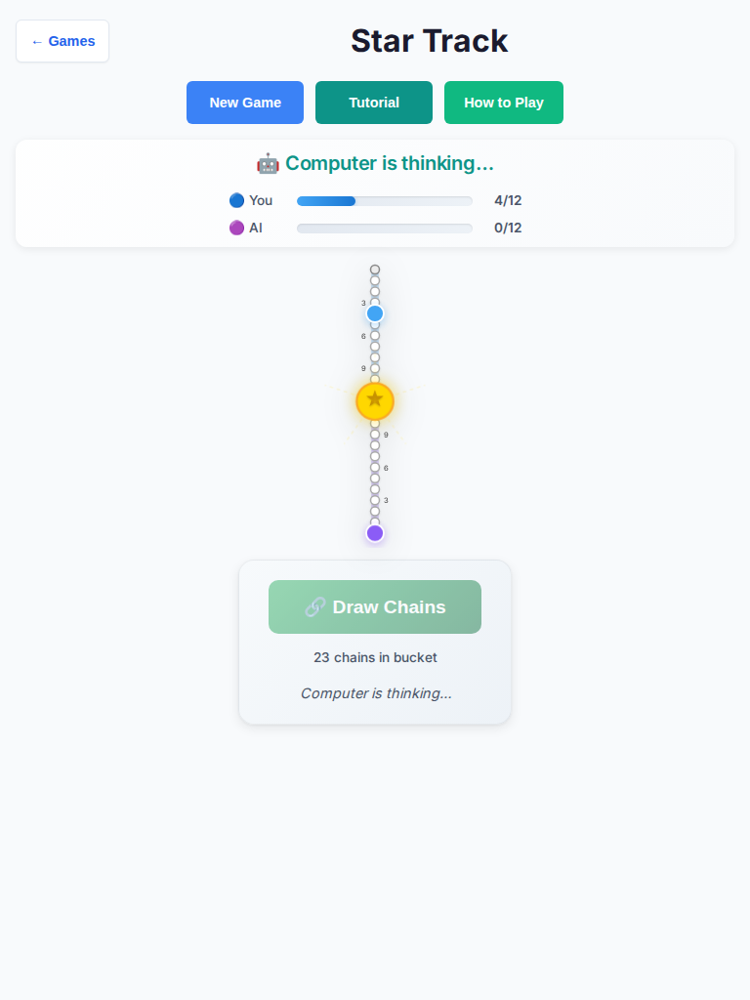
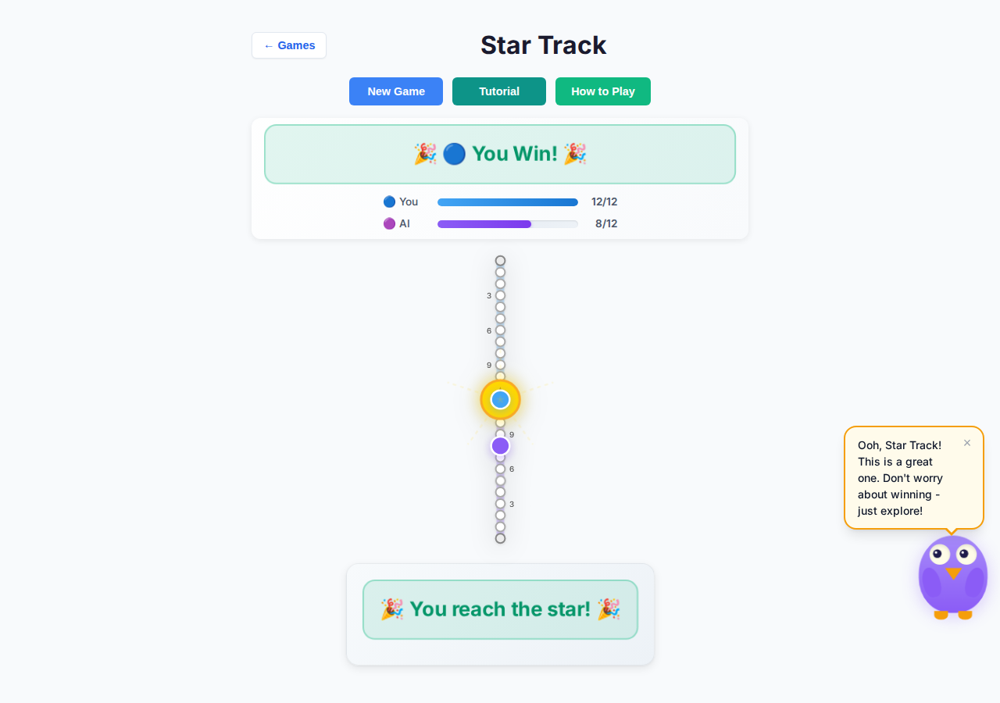
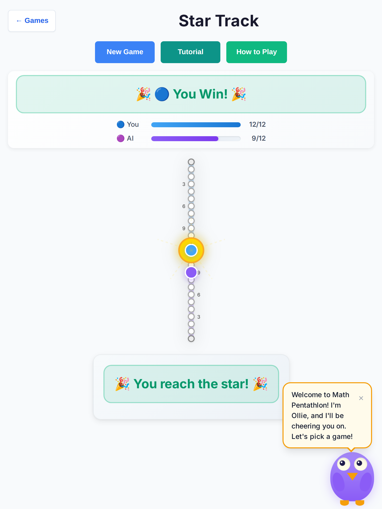
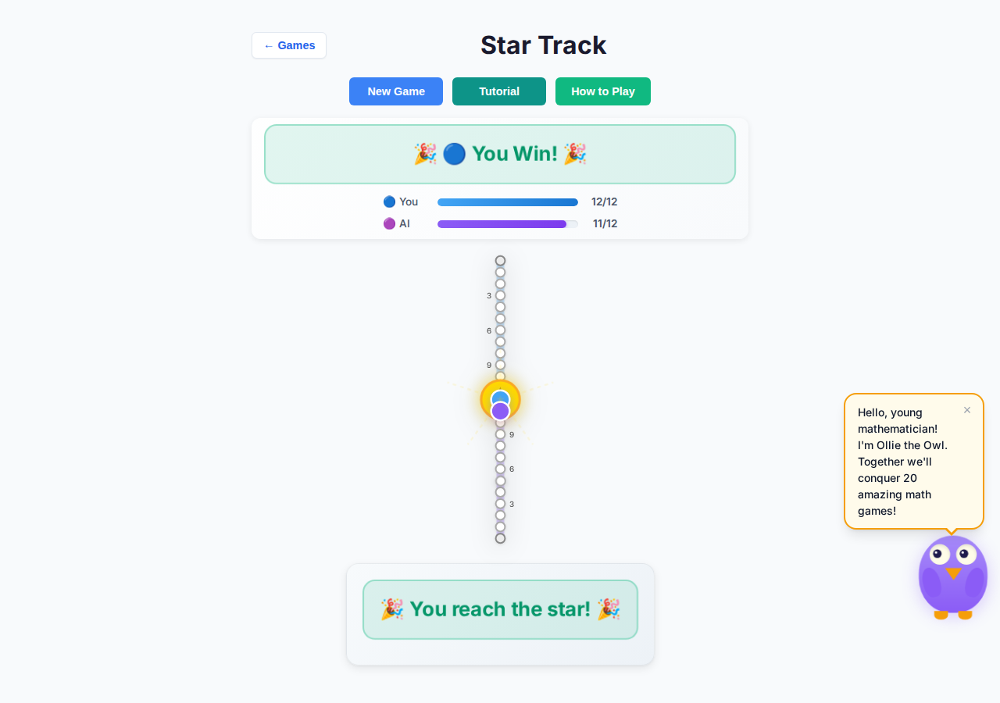

# Star Track deep playtest — 2026-10-07

**Branch:** `cursor/star-track-deep-playtest-f738`  
**Base:** `cursor/overnight-polish-integration-0494`  
**Scope:** Playability only (stalls, soft-locks, AI timer races, console errors, ≥44px touch targets, turn copy, slow AI pauses). **No rules or scoring changes.**  
**Harness:** `tests/playtest/star-track-deep-playtest.mjs` against Vite preview (`dist/`).  
**Raw results:** [`star-track-deep-results.json`](./star-track-deep-results.json)

## Matrix

| Viewport | Easy | Medium | Hard | Total |
|----------|------|--------|------|-------|
| Desktop Chromium 1280×800 | 10 | 10 | 10 | 30 |
| Tablet Chromium 768×1024 (touch + coarse pointer) | 10 | 10 | 10 | 30 |
| **All** | **20** | **20** | **20** | **60** |

Human seat played greedy longest-chain; AI seat used Easy / Medium / Hard.

## Outcomes

| Metric | Result |
|--------|--------|
| Games completed to a terminal banner | **60 / 60** |
| Soft-locks / stalls | **0** |
| Console / page errors | **0** games |
| Confusing Blue/Red turn copy (HvA) | **0** |
| Interactive controls under 44×44 | **0** |
| Mean wall time / game | **~2.5 s** (AI draw 400ms + select 350ms) |
| Human wins / AI wins / draws | **47 / 13 / 0** |

### By cell

All six cells completed 10/10 with zero findings:

- `desktop/easy`, `desktop/medium`, `desktop/hard`
- `tablet/easy`, `tablet/medium`, `tablet/hard`

## Fixes landed (playability)

1. **AI timer races** — Nested `setTimeout` draw→select was not cancelled on New Game / destroy. Controllers for Prime Gold / Pent’Em In already cleared timers; Star Track now clears both timers, bumps a generation token, and no-ops stale callbacks (`game-controller.ts`).
2. **AI select soft-lock guard** — If `getAIChainChoice` returns null while Red is on `selectChain` with drawn chains, auto-select index `0` so the seat cannot strand.
3. **Slow AI pauses** — Per-phase delays cut from 600+600ms (**1200ms**) to **400+350ms** (**750ms**) while keeping visible “Computer is thinking…” chrome.
4. **Confusing turn copy** — HvA status mapped Blue/Red → Your/Computer via `formatPhaseStatusMessage`; winner line uses **You Win!** (not “You Wins!”); board banner uses You/AI in HvA.
5. **Touch targets** — Narrow layout had `.star-track-chain-btn { min-width: 0 }`, which could shrink below 44px; now **min-width: 44px** (with existing coarse-pointer rules).

## Screenshots

### Open (New Game → Vs AI)





### Mid-turn (human choosing a chain)





Status: **You: Choose a chain to move** (not Blue/Red).

### AI thinking





Status shows **Computer is thinking…**; draw/chain chrome is disabled and non-interactive.

### Game over







## Touch target spot-checks

Measured live during playtest (bounding boxes):

| Viewport | Control | Size | ≥44×44 |
|----------|---------|------|--------|
| Desktop | Chain buttons (select) | ~106×102, ~210×102 | yes |
| Desktop | Draw (AI thinking, disabled) | ~218×55 | yes |
| Tablet (coarse) | Chain buttons | ~132–210×102 | yes |

## Rules / scoring notes (not changed)

Document-only — escalate if product wants follow-up:

1. **`getPhaseMessage` in `rules.ts` still says Blue/Red.** UI maps these for HvA; leave rules helper as seat-color vocabulary for HvH / tests.
2. **Win clamp / overshoot** — Landing past `TRACK_LENGTH` clamps to the star (existing unit coverage). Observed as intended; not a playability stall.
3. **Bucket exhaust** — When fewer than 2 chains remain, game ends by position (or draw). No soft-lock in 60 games; balance of exhaust vs race not evaluated.
4. **Difficulty win skew** — Greedy-longest human won 47/60. Easy/Medium/Hard pacing felt similar under that script; AI strength balance is out of playability scope.
5. **Ollie speech** — Shared owl intro can still float over a finished board (“Let’s pick a game!”). Shell-wide owl, not Star Track sources — left alone per touch scope.

## Verification commands

```bash
npm run lint
npx tsc --noEmit
npx vitest run tests/unit/star-track*.test.ts tests/unit/overnight-wave69-star-track*.test.ts \
  tests/unit/overnight-wave52-star-status*.test.ts tests/unit/mp3d-star-track*.test.ts
npx playwright test --project=chromium tests/e2e/mp3d-star-track-board3d.spec.ts \
  tests/e2e/smoke.spec.ts -g 'star-track|Star Track|Every game|landing'
PLAYTEST_BASE_URL=http://127.0.0.1:5173 node tests/playtest/star-track-deep-playtest.mjs
```

Lint / `tsc` / Star Track unit (57) / focused Chromium e2e (26, including Star Track 3D + smoke) passed in this run. Full Chromium suite still has unrelated pre-existing 3D timeouts in Kings / Pent’Em In / Prime Gold / Queens & Guards — not Star Track.
