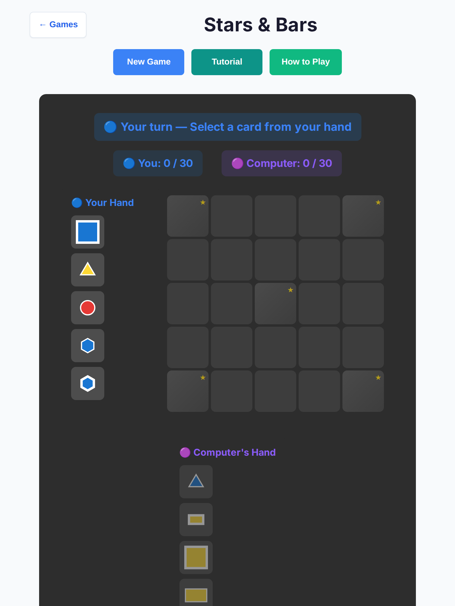
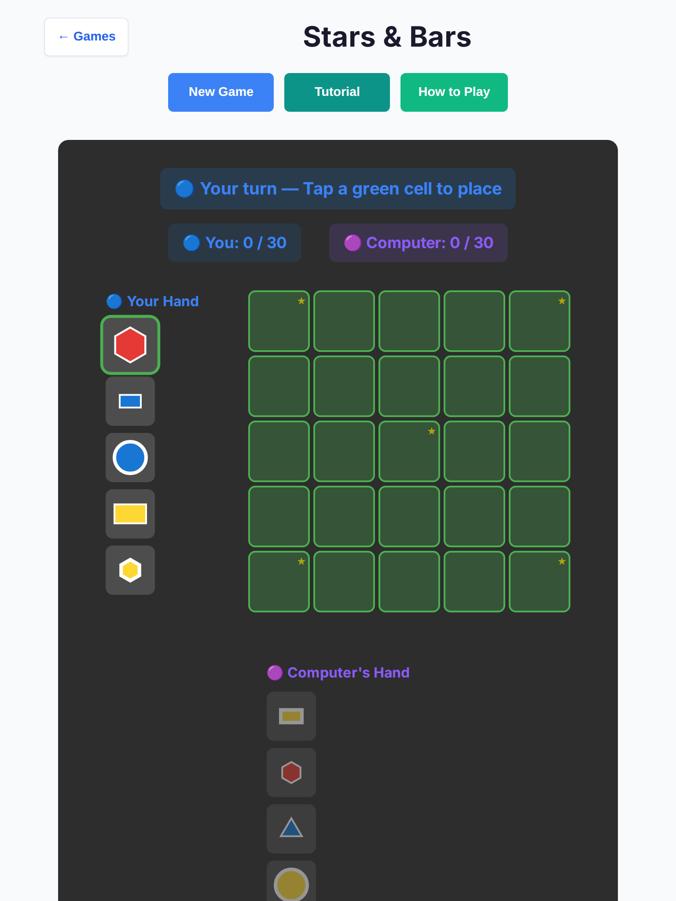
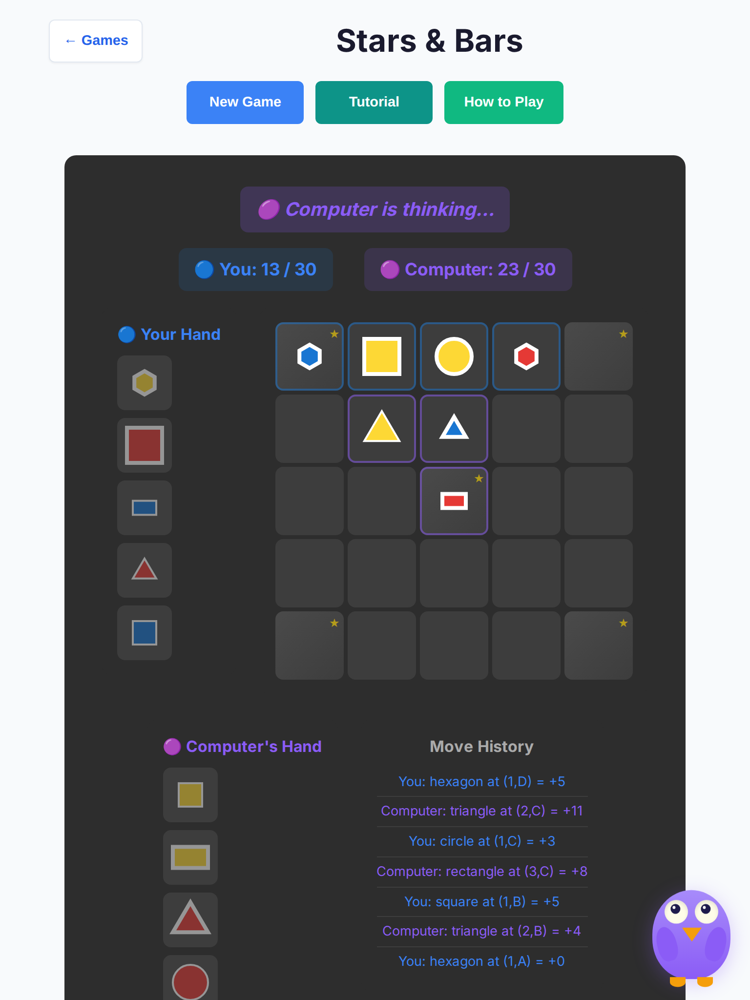
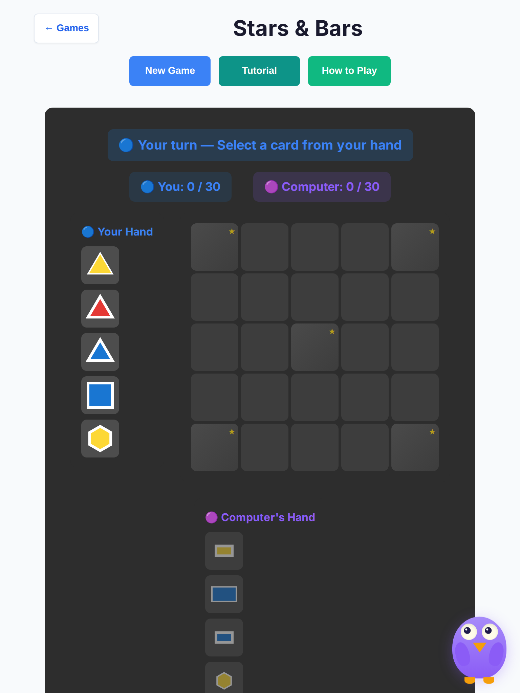
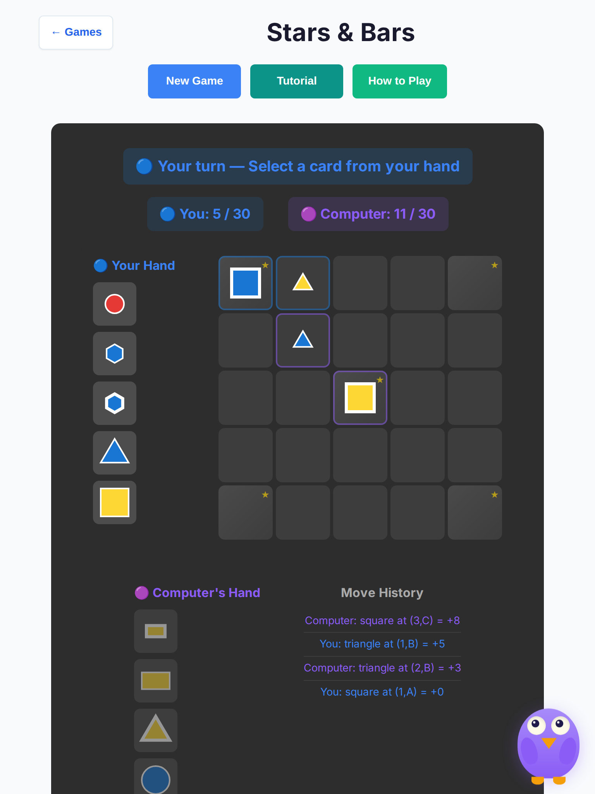
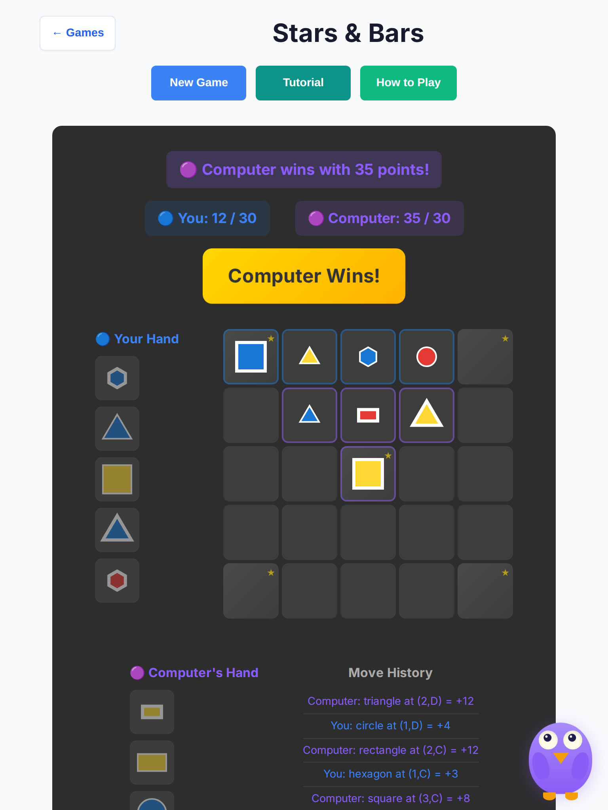
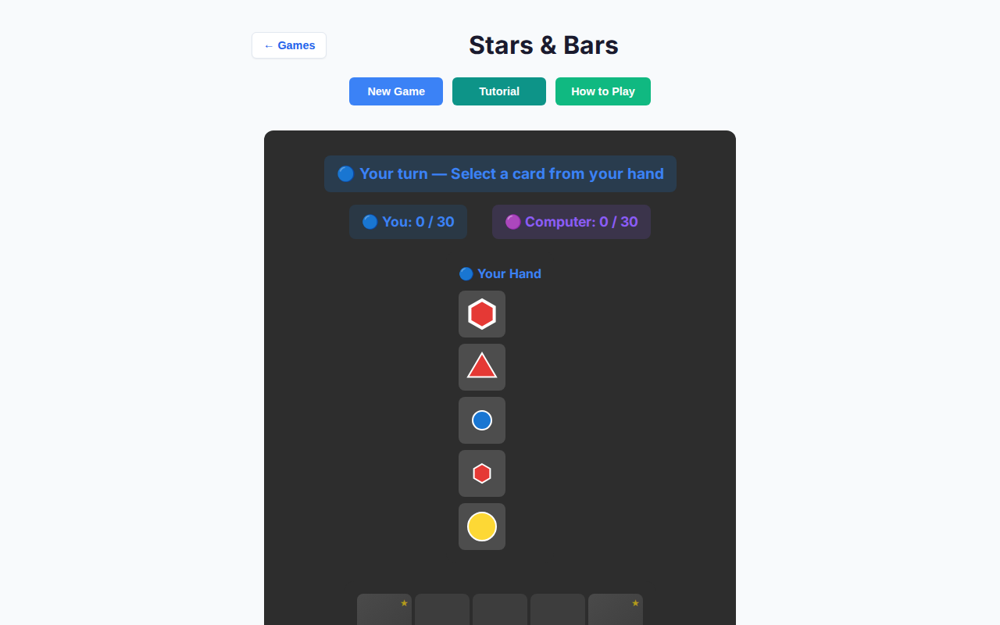
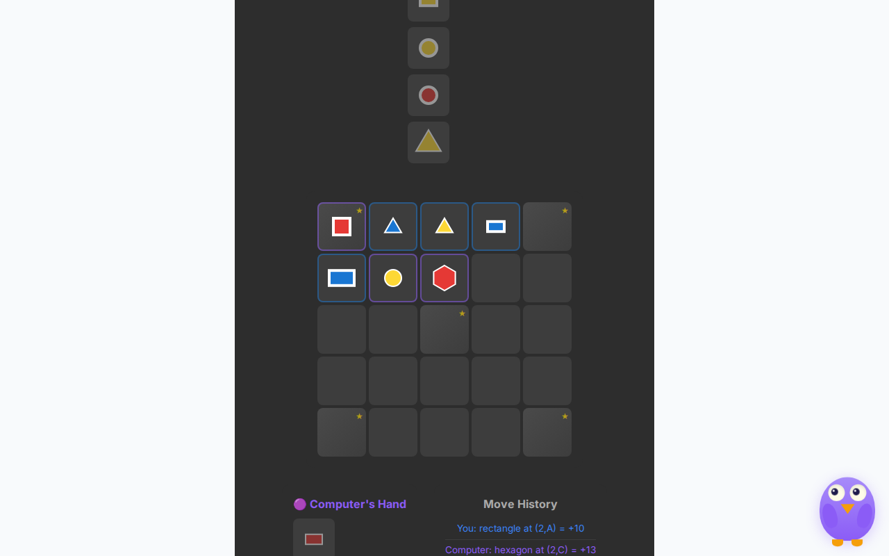
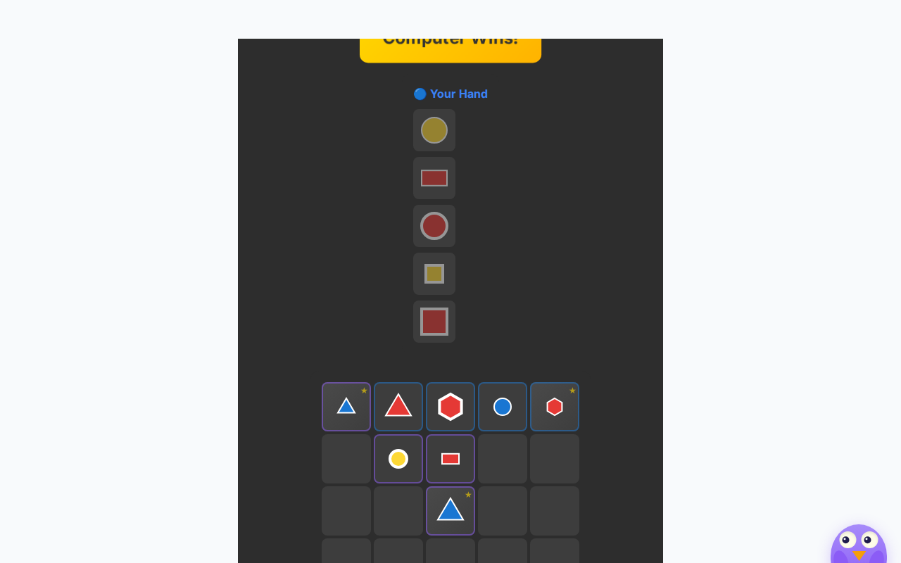

# Stars & Bars deep playtest — 2026-10-07

Human vs AI · Easy / Medium / Hard · tablet (iPad Mini 768×1024, touch) + desktop (1280×800) · headless Chromium.

Stacked on `cursor/overnight-polish-integration-0494`. **No rules or scoring changes.**

## Method

- Local Vite (`127.0.0.1:5173`) + Playwright Chromium headless
- Scripted human: select a hand card → tap a green cell (or Pass) → wait for AI
- **10 full games × 3 difficulties × 2 viewports = 60 games**
- Also probed New Game mid–AI-pause (stale timer race)
- Wall clock ~3 min for the full matrix after fixes; typical AI handoff ~550–675 ms (450 ms think + search)

Harness: `scripts/stars-bars-deep-playtest.mjs` · raw data: [`results.json`](./stars-bars-deep-2026-10-07/results.json)

## Results matrix

| Viewport | Difficulty | Games | Ended | Stalls | Max AI handoff | Notes |
| --- | --- | --- | --- | --- | --- | --- |
| tablet | Easy | 10 | 10 | 0 | 676 ms | All Computer wins (scripted human) |
| tablet | Medium | 10 | 10 | 0 | 1015 ms | Mix of short races to 30 |
| tablet | Hard | 10 | 10 | 0 | 675 ms | Clean finishes |
| desktop | Easy | 10 | 10 | 0 | 673 ms | Clean finishes |
| desktop | Medium | 10 | 10 | 0 | 2222 ms* | One outlier sample (see below) |
| desktop | Hard | 10 | 10 | 0 | 673 ms | Clean finishes |

\*Outlier is wall-clock human→AI→human including script wait; typical desktop Medium handoffs stayed ≤676 ms.

**Totals:** 60 ended · **0 stalls** · **0 console / page errors** · New Game race suspicious hits: **0**

Outcomes (scripted human): Human 0 · AI 60 · draw 0

## Findings

| # | Issue | Severity | Status |
| --- | --- | --- | --- |
| 1 | **Stale AI `setTimeout` after New Game / re-init** — every `updateUI` scheduled `makeAIMove(800)` without clearing; shell `newGameVsAI` → `initGame` left orphan timers that could place on a fresh board | high | **Fixed** — module `aiTimer` + `clearAiTimer` / `scheduleAI`; seat guard in `makeAIMove`; `450ms` think |
| 2 | **Pass / Clear under 44px** — `.stars-btn` padding-only height ~34px | medium | **Fixed** — `min-height: 44px` (+ 48px on coarse / ≤900px) |
| 3 | **Confusing turn copy in vs-AI** — status/scores/hands said Blue/Red while chrome used purple Computer seat | medium | **Fixed** — You / Computer labels; “Your turn — Select/Tap…”; `.status-ai-thinking` |
| 4 | **AI think pause felt slow** — fixed 800 ms before search | low | **Fixed** — 450 ms think (still well under 3 s) |

### Non-issues (verified)

- AI-seat input lock still blocks human card/cell/Pass during think pause (existing guard + timer clear)
- Board cells 70×70; tablet hand cards 56×56; Clear button ~143×48 on tablet — all ≥44px
- No console spam across 60 games
- New Game mid-think leaves empty board + “Your turn — Select a card…”
- Games reliably reach a winner banner (no soft-lock in this matrix)

### Rules-related (documented only — not changed)

| Observation | Notes |
| --- | --- |
| **Target 30 is very fast** | Scripted and AI games often ended in ~3–4 human turns when star cells + multi-adjacency stacked. Balance / target score is a rules question, not a playability bug. |
| **Mutual pass if board fills below 30** | `passTurn` never settles when both seats can only pass (full board, neither at target). Not hit in this 60-game matrix; would be a rules/end-condition change to auto-settle. |
| **AI win rate vs weak human** | 60/60 Computer wins under random-ish human script — expected for a greedy AI; not a stall. |

## Screenshots

| Shot | File |
| --- | --- |
| Tablet start (You / Computer scores) |  |
| Tablet placing hint |  |
| Tablet AI thinking |  |
| Tablet Medium New Game race (clean) |  |
| Tablet Easy mid |  |
| Tablet Easy end |  |
| Desktop start |  |
| Desktop AI thinking |  |
| Desktop Easy end |  |

## Code / tests

- `src/games/stars-bars/game-controller.ts` — AI timer, seat guard, You/Computer status copy, 450 ms think
- `src/games/stars-bars/board-ui.ts` — seat labels, 44px floors, coarse media query, `#stars-styles`
- `tests/unit/stars-bars-ai-timer-race.test.ts`
- `tests/unit/stars-bars-deep-playability.test.ts`
- `tests/unit/stars-bars-ai-input-guard.test.ts` (title/delay wording)
- `tests/e2e/stars-bars-deep.spec.ts` (Chromium tablet + desktop)
- `scripts/stars-bars-deep-playtest.mjs`

## Hard stops honored

- No merges; did not edit or close other PRs
- Stars & Bars sources + its tests/docs/harness only
- No rules / scoring / win-condition changes
