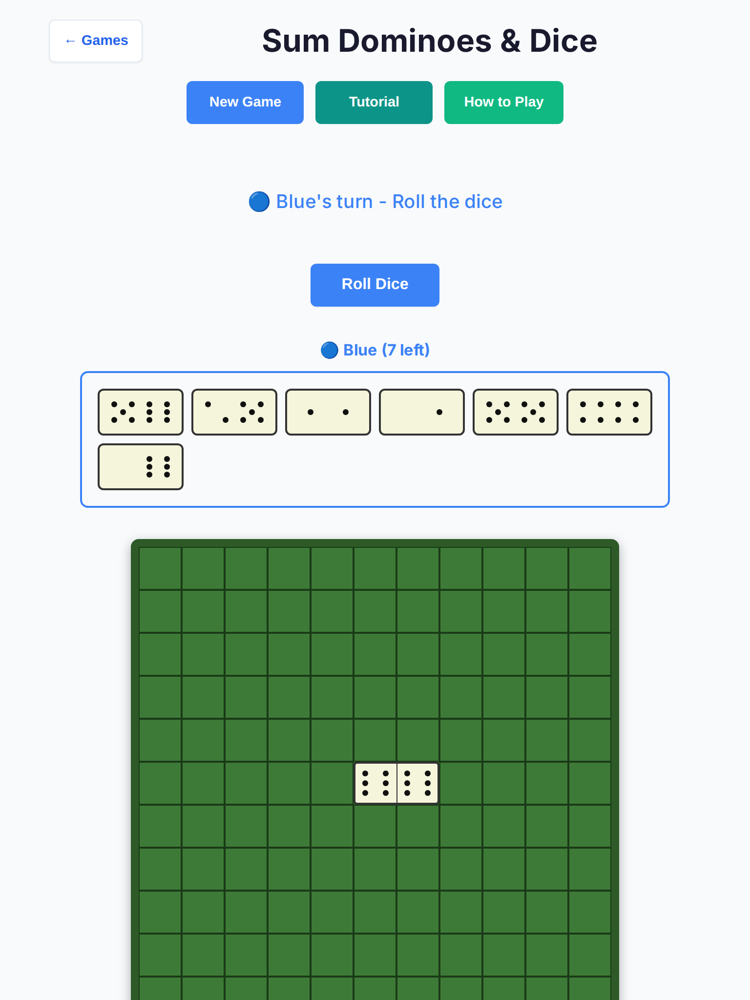
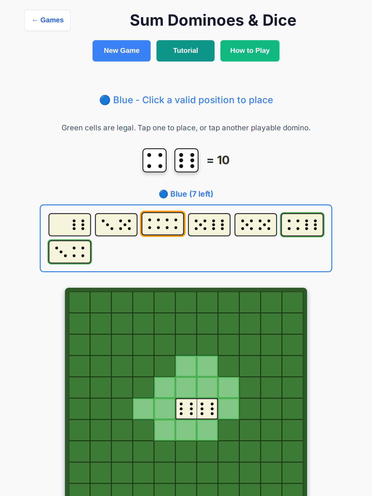
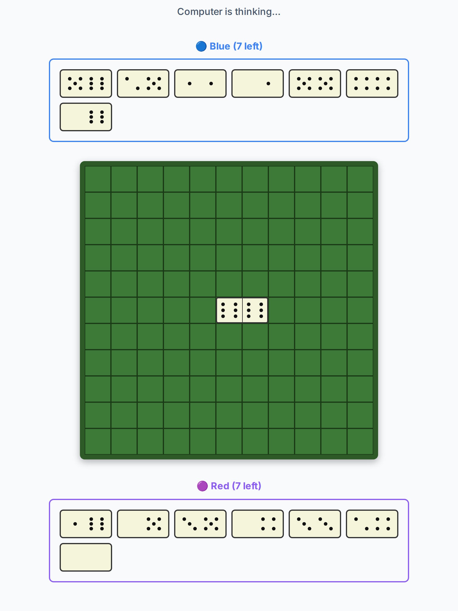
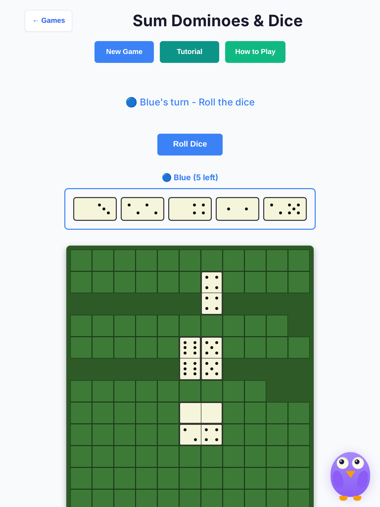
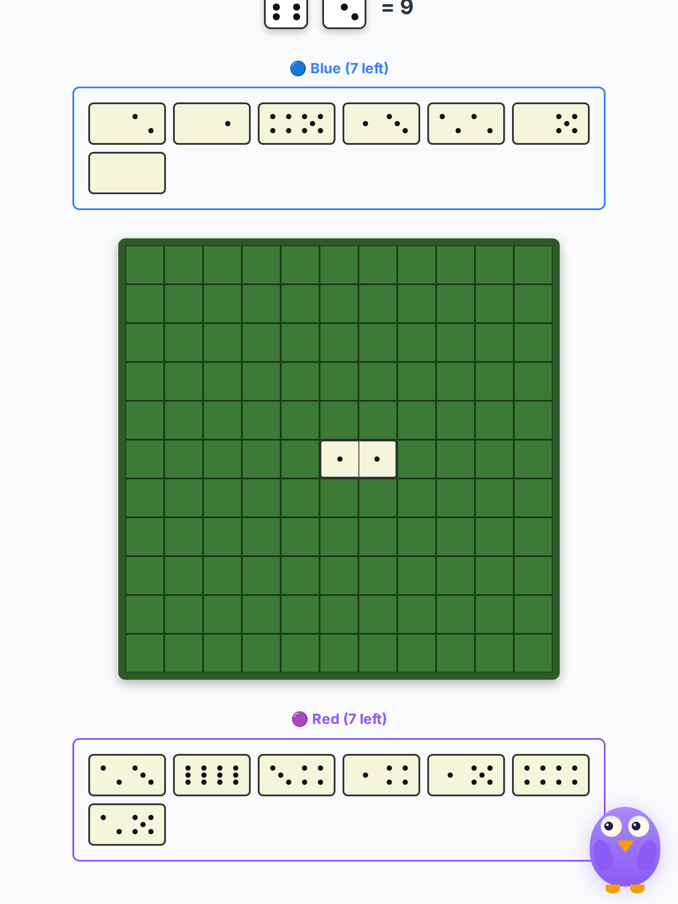
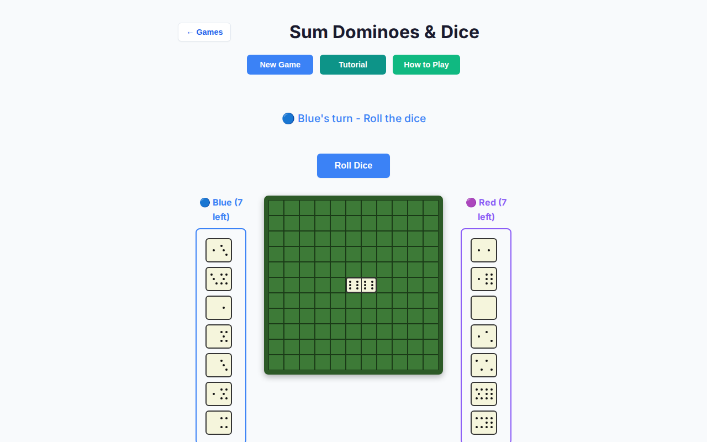
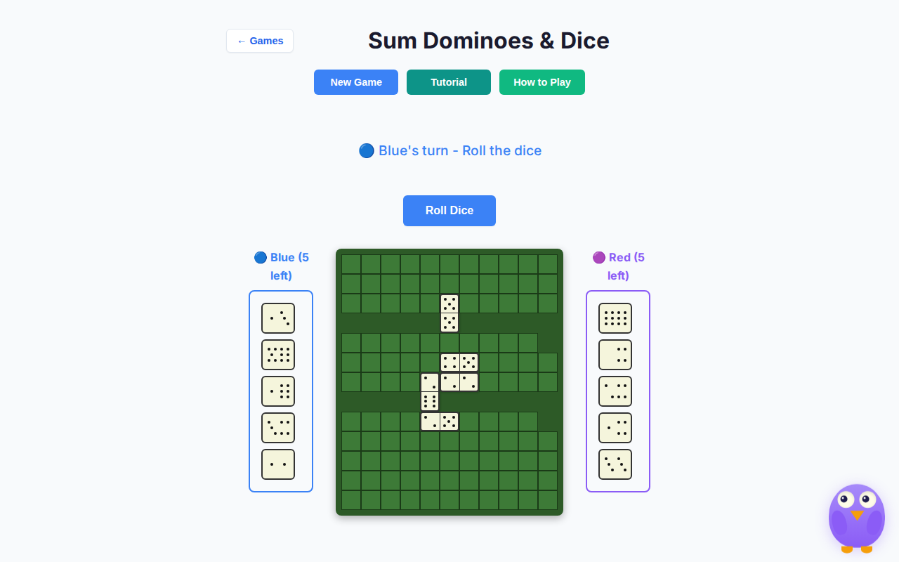
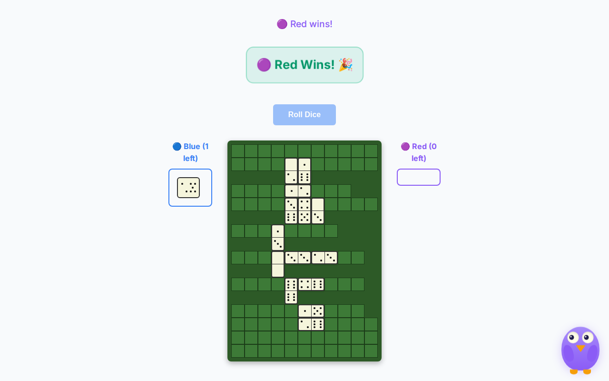

# Sum Dominoes — deep playtest (2026-10-07)

Human vs AI · Easy / Medium / Hard · tablet (768×1024, iPad Mini touch) + desktop (1280×800) · headless Chromium.

**Scope:** playability only — no rules or scoring changes.  
**Harness:** `scripts/sum-dominoes-deep-playtest.mjs` · raw data `sum-dominoes-deep-2026-10-07/results.json`.  
**Base:** `cursor/overnight-polish-integration-0494`.

## Method

- Local Vite (`127.0.0.1:5173`) + Playwright Chromium headless
- **10 full games × 3 difficulties × 2 viewports = 60 games**
- Each game played until winner banner / draw, stall (12s no human affordance), or 80 human turns
- Greedy human: Roll → first playable hand tile → first valid cell (or Pass)
- Captured console errors, page errors, illicit auto-roll on Blue, touch metrics, AI “thinking” sightings

## Results (post-fix)

| Metric | Value |
| --- | --- |
| Games completed | **60 / 60** |
| Stalls / turn-budget | **0** |
| Illicit Blue auto-roll | **0** |
| Console / page errors | **0** |
| Outcomes | Human 35 · AI 25 · Draw 0 |

### By viewport × difficulty

| Combo | Human wins | AI wins | Typical human turns |
| --- | --- | --- | --- |
| tablet / easy | 3 | 7 | 6–8 |
| tablet / medium | 8 | 2 | 6–8 |
| tablet / hard | 4 | 6 | 1–7 |
| desktop / easy | 7 | 3 | 1–7 |
| desktop / medium | 7 | 3 | 6–8 |
| desktop / hard | 6 | 4 | 1–7 |

Short games (1 human turn) are legal double-pass pip settles when opening rolls find no placement — not stalls.

AI think UI (status “computer is thinking…” / `.sd-computer-thinking`) was observed on every handoff (`think≥1` per game).

## Bugs found & fixed

### 1. Critical — AI timer race rolled Blue’s dice (stall / stolen turn)

**Symptom:** After Red finished, a stale `setTimeout` from `updateUI` + a chained post-roll timer could call `makeAIMove` while Blue was to move. `makeAIMove` only checked `aiPlayer` / winner, not seat — so it called `doRollDice` for Blue.

**Fix (`game-controller.ts`):** Single clearable `aiTimer` (Prime Gold pattern), `scheduleAI` / `clearAiTimer`, hard `isComputerTurnPending` guard at the top of `makeAIMove`.

**Regression:** `tests/unit/sum-dominoes-ai-timer-race.test.ts`, deep unit + e2e.

### 2. High — AI soft-lock if `getAIMove` returned null in `placing`

**Symptom:** Controller ignored a null move and never passed or placed → seat freeze.

**Fix:** Fallback to first legal `getValidPlacements` tile; only if none exist, escape via `passTurn` with phase `passing`. Rules/scoring unchanged.

### 3. High — Touch targets below 44px (tablet)

**Pre-fix (from overnight report):** hand ~40×20, board cells ~22px, Roll ~36px tall.

**Post-fix measures:**

| Target | Tablet | Desktop |
| --- | --- | --- |
| Roll | 132×**44** | 132×**44** |
| Hand tiles | 88×**48** | 48×**44** |
| Board cells | **44×44** | 28×28 |

Coarse pointer / `max-width: 900px` media query enlarges the whole grid (keeps rows aligned). Valid cells get a green outline. Roll/Pass min-height 44 via injected CSS.

### 4. Medium — Unclear place / pass UX

**Fix:** Secondary `.sd-turn-hint` under locked primary status copy (overnight exact-string tests preserved). Tap selected domino again to deselect.

## Observations (not changed)

- **Desktop board cells 28px** — fine for mouse; tablet path is 44px. Widening desktop cells further would grow the 11×11 board; left as residual.
- **Difficulty vs greedy bot** is noisy (dice variance); Easy is not “too slow.” No AI think > ~1.4s observed.
- Locked status strings (`Select a domino to play`, etc.) intentionally unchanged.

## Screenshots

| Scene | File |
| --- | --- |
| Tablet start (vs AI) |  |
| Tablet placing + hint |  |
| Tablet AI thinking |  |
| Tablet medium mid |  |
| Tablet easy end |  |
| Desktop start |  |
| Desktop easy mid |  |
| Desktop hard end |  |

## Tests added

- `tests/unit/sum-dominoes-ai-timer-race.test.ts`
- `tests/unit/sum-dominoes-deep-playability.test.ts` (12× Easy/Med/Hard scripted finishes, hints, deselect, CSS floors)
- `tests/e2e/sum-dominoes-deep.spec.ts` (desktop ×3 difficulties + tablet touch floors + no illicit roll)

## Files touched

- `src/games/sum-dominoes/{game-controller,board-ui,rules}.ts`
- Tests / docs / `scripts/sum-dominoes-deep-playtest.mjs` only (no other games)
