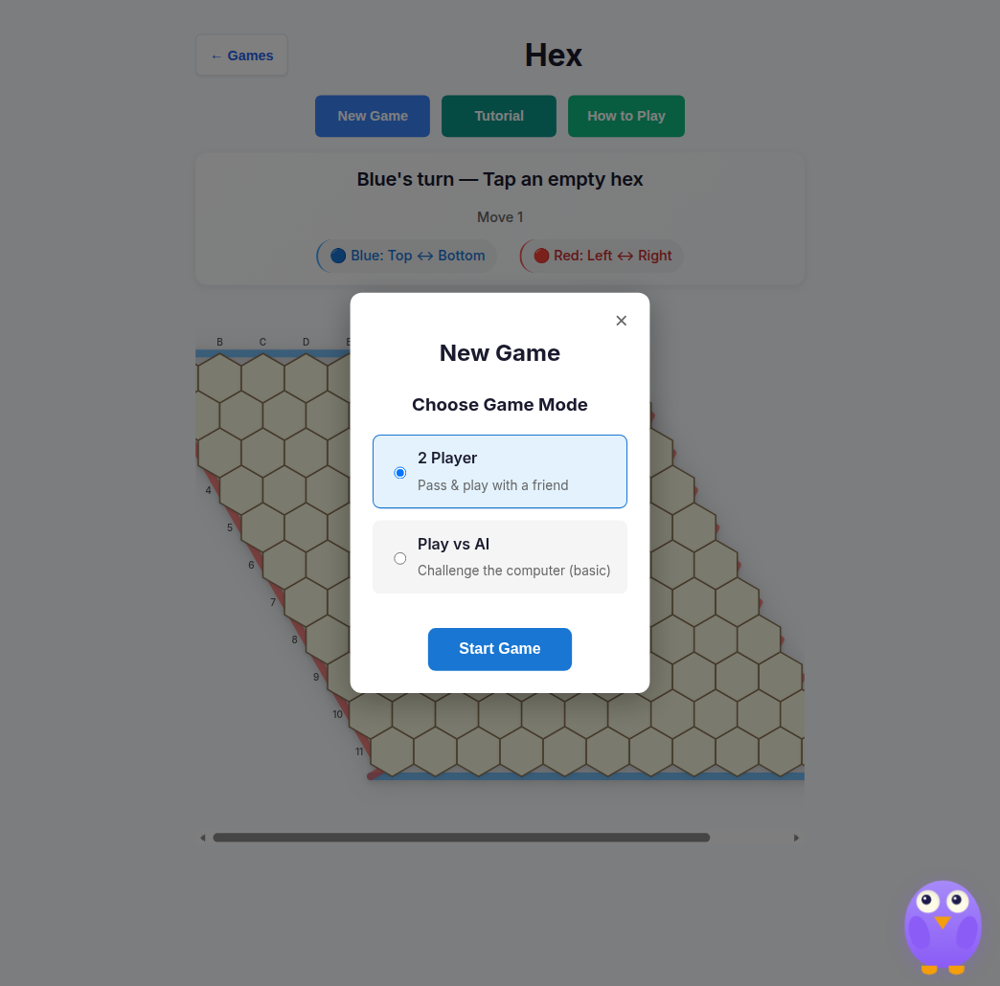
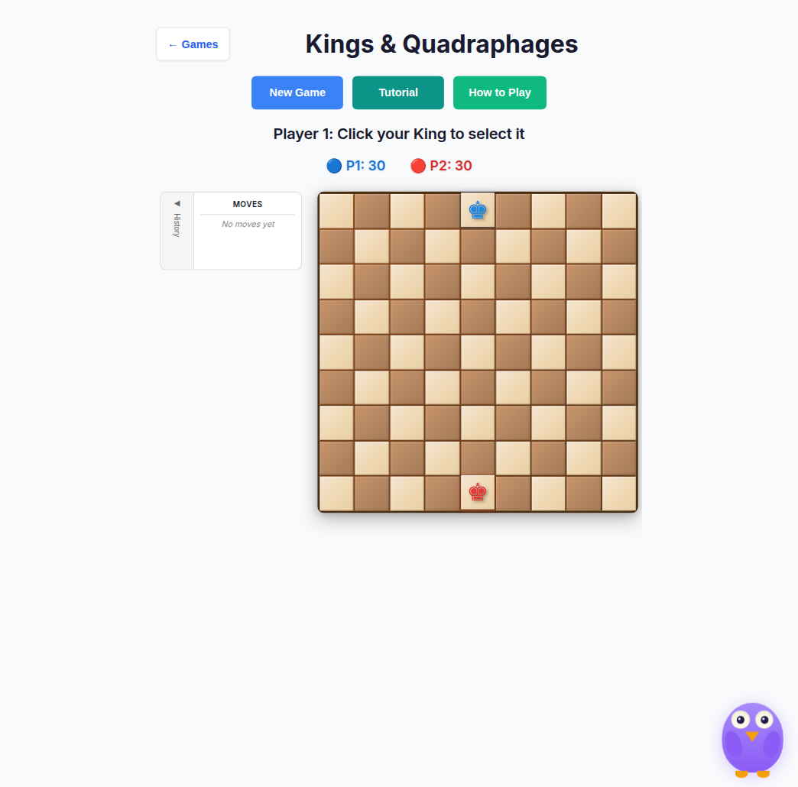

# How to add a game

Docs-only checklist for builders. Prefer an existing game (for example Kings & Quadraphages or Hex) as the template. Escalate scoring / official rules changes per [`AGENTS.md`](../../AGENTS.md).

## 1. Module layout

Create `src/games/<id>/` with the usual split:

| File | Role |
| ---- | ---- |
| `game-state.ts` | State shape + pure transitions (no DOM) |
| `rules.ts` | Validation / win detection (plain objects in/out) |
| `board-ui.ts` | DOM board rendering |
| `game-controller.ts` | Wire shell events → state → UI |
| `ai.ts` / `serialization.ts` | Optional; follow neighboring games |
| `index.ts` | Optional barrel |

Positions and immutability conventions: [`.github/copilot-instructions.md`](../../.github/copilot-instructions.md). Reuse [Big Toads](./big-toads.md) under `src/core/` instead of copying dice/hex/fraction helpers.

## 2. Register the game

In `src/core/game-registry.ts`:

1. Append a `GameInfo` with a unique `id`.
2. Set division, grades, description, difficulty, icon.
3. Keep `available: false` until the mount path works, then flip to `true`.

Details: [Game registry](./game-registry.md).

## 3. Wire the route mount

In `src/ui/game-route-mounts.ts`:

1. Add a `render…` function that dynamic-imports the controller, mounts the shared shell (`mountGameShell`), and binds New Game / Tutorial / Help.
2. Add a matching `case '<id>':` in `mountGameById`.

Also add a matching loader key in `src/ui/game-prefetch.ts` so idle/menu prefetch stays aligned with the registry and mount switch (three-way id handshake).

`src/main.ts` already routes `/#/game/:id` through this switch — you should not add a new top-level route for a catalog game.

## 4. Tests (minimum)

| Layer | Expectation |
| ----- | ----------- |
| Unit | State + rules under `tests/unit/` (Vitest + jsdom) |
| E2E smoke | Card appears; game route loads (see `tests/e2e/smoke.spec.ts`) |
| Axe | Shell New Game modal is covered automatically once the game is `available` (`tests/e2e/a11y-sweep.spec.ts`) |
| Visual | Opt-in `npm run test:visual`; e2e openings via `npm run test:e2e:visual` (CI report-only) |
| Round-trip / undo | Prefer adding harness coverage when the game has serialize or move-log APIs — see [testing layers](./development.md#testing-layers) |

## 5. Manual smoke

1. `npm run dev` → confirm the card on the landing page.
2. Open `/#/game/<id>` → New Game → 2 Player → Start Game.
3. Tab through the board if you wired `src/ui/board-a11y.ts` helpers ([Accessibility](./accessibility.md)).

Reference shell (Hex New Game modal from a live capture):

Reference board chrome (Kings & Quadraphages):

## Out of scope without human review

- Official tournament scoring or student-facing records
- Promoting `alpha` → `main`
- Inventing catalog entries that are not real Math Pentathlon games
