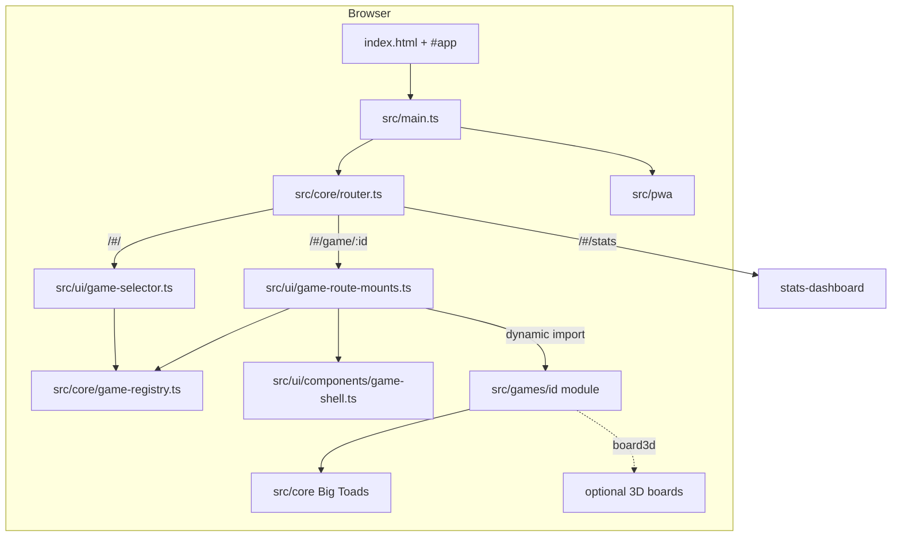
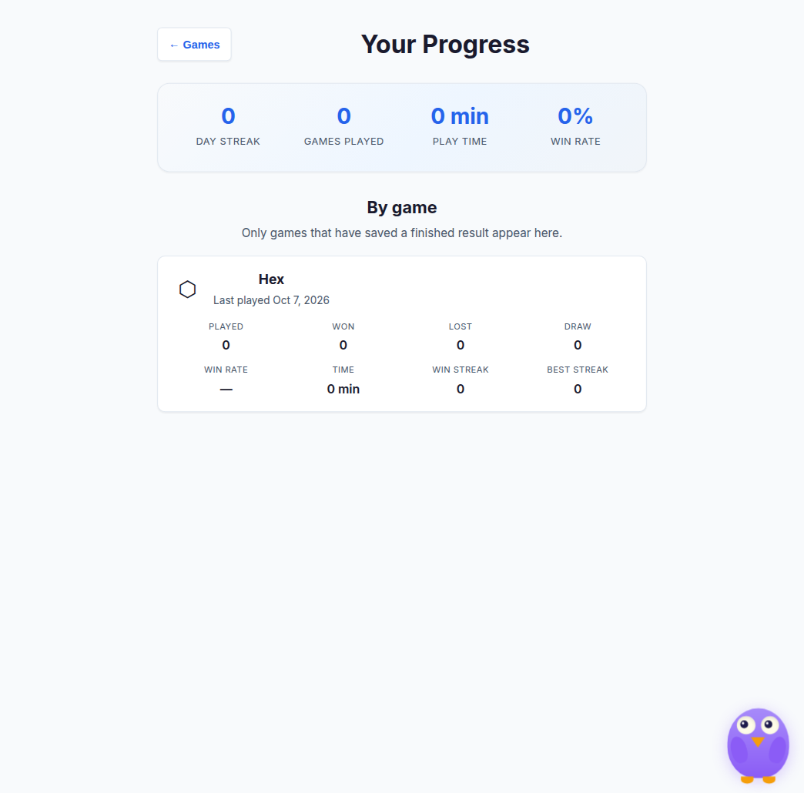

# Architecture

How the practice app is wired: hash router → registry → lazy game mounts → pure rules/state. Screenshots were captured from a local `npm run dev` session on the docs tip branch.

## Runtime diagram

## Layers

| Layer | Responsibility | Typical paths |
| ----- | -------------- | ------------- |
| Bootstrap | Mount `#app`, bind offline / reduced-motion, start PWA + idle warm | `src/main.ts`, `src/pwa/` |
| Router | Hash routes for home, stats, games, core demos | `src/core/router.ts` |
| Registry | Canonical game ids, names, divisions, availability | `src/core/game-registry.ts` |
| Menu shell | Division tabs/cards from the registry | `src/ui/game-selector.ts` |
| Game shell | Shared chrome: back, New Game, Tutorial, How to Play | `src/ui/components/game-shell.ts` |
| Game mounts | One `case` per registry id; lazy-loads that game’s controller | `src/ui/game-route-mounts.ts` |
| Game module | Pure state/rules + DOM UI + controller wiring | `src/games/<id>/` |
| Big Toads | Shared dice, hex, fractions, polyomino, … | `src/core/` — see [Big Toads](./big-toads.md) |

**Rules:** domain logic stays DOM-free. Controllers and `*-ui.ts` call into pure functions under `game-state.ts` / `rules.ts`.

## What you see in the app

Landing (registry-driven menu):

Shared game shell + Hex opening board after Start Game:

New Game modal (axe sweep covers this dialog surface):

Progress dashboard (`/#/stats`):

## Related reading

- [Game registry](./game-registry.md)
- [How to add a game](./adding-a-game.md)
- [Development & testing layers](./development.md)
- [Big Toads](./big-toads.md)
