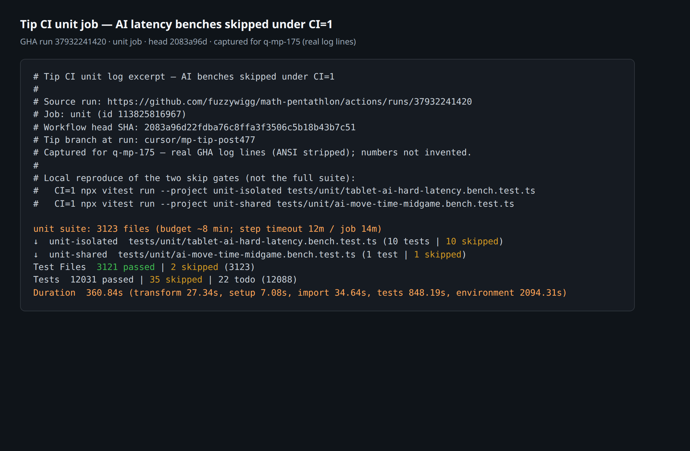

# CI unit job budget + AI-bench skips

**Task id:** `q-mp-233` (refresh of `q-mp-175`); suite-size cells remeasured by `q-mp-235`  
**Scope:** Docs / visuals only — no workflow edits, no AI timing or product changes.  
**Tip at authoring:** `cursor/mp-tip-post748` @ `23926935` (full SHA `23926935c3c8c5771797c8ef6b5fb172b04b60e0`). Wall-budget + AI-bench CI evidence below still cites tip post728 run [`37972882883`](https://github.com/fuzzywigg/math-pentathlon/actions/runs/37972882883) (open draft [#746](https://github.com/fuzzywigg/math-pentathlon/pull/746) ownership).

Short contributor page for the **unit** job wall budget and why the two AI latency benches stay skipped when `CI=1`. Orthogonal to the blocking-vs-report-only job graph in [`docs/dev/ci-gates-mermaid-q-mp-073.md`](../dev/ci-gates-mermaid-q-mp-073.md). Full CI-skip inventory + HOLD citations: [`docs/dev/ai-timing-ci-skip-inventory-2026-10-09.md`](../dev/ai-timing-ci-skip-inventory-2026-10-09.md). Layer file/case tables: [`docs/dev/testing-layers-2026-10-09.md`](../dev/testing-layers-2026-10-09.md) (`q-mp-235`); this page owns the **unit wall budget** + AI-bench skip evidence only.

## Hard-rule HOLD (AI timing)

Workers must **not** change AI timing asserts, deadlines, search, scoring, or difficulty.

| Rule | Live tip pin |
| --- | --- |
| Hex Hard play deadline stays **450ms** | `src/games/hex/ai.ts` — `hard: 450` |
| Unit characterization of that pin | `tests/unit/ai-hard-midgame-identity.test.ts` — `expect(HEX_MS.hard).toBeLessThanOrEqual(450)` |
| Do not enable the two AI benches on GHA | Keep `describe.skipIf(!!process.env.CI)` on the files below |
| CI permissions stay read-only | `permissions: contents: read` + `persist-credentials: false` on checkout |

Do **not** “fix” Hex Hard by raising the deadline above 450ms. Do **not** remove the CI skips to chase coverage on shared runners.

## Unit job time budget (live `ci.yml`)

From `.github/workflows/ci.yml` `unit` job (re-read on tip `23926935`; knobs unchanged from post728):

| Knob | Value |
| --- | --- |
| Target wall | ~**8 min** (job comment + step echo) |
| Step timeout | **12m** (`Run unit tests`) |
| Job timeout | **14m** |


## Live suite size (tip `23926935`)

Remeasured on tip post748 (same formulas CI / testing-layers use). Historical GHA summary row is from tip post728 run [`37972882883`](https://github.com/fuzzywigg/math-pentathlon/actions/runs/37972882883) when the suite was **3140** files:

| Metric | Count | How |
| --- | ---: | --- |
| Unit files (excl. `_tokenmaxx_archive`) | **3145** | `find tests/unit … \| wc -l` (matches CI echo) |
| Cases listed | **12189** | `npx vitest list \| wc -l` |
| Tip CI run summary (post728 @ `b5884207`) | **3138** passed / **2** skipped files; **12142** passed / **42** skipped / **1** todo (**12185**) | run [`37972882883`](https://github.com/fuzzywigg/math-pentathlon/actions/runs/37972882883) |

Vitest `list` counts and the GHA summary totals differ slightly (list includes entries that resolve differently at run time); file/case rows are tip-live.

## Two AI benches skipped under `CI=1`

| File | Gate | Tip CI evidence (run [`37972882883`](https://github.com/fuzzywigg/math-pentathlon/actions/runs/37972882883)) |
| --- | --- | --- |
| `tests/unit/tablet-ai-hard-latency.bench.test.ts` | `describe.skipIf(!!process.env.CI)` | `(10 tests \| 10 skipped)` |
| `tests/unit/ai-move-time-midgame.bench.test.ts` | `describe.skipIf(!!process.env.CI)` | `(1 test \| 1 skipped)` |

Together they are the **2 skipped test files** in that run’s summary: `Test Files 3138 passed | 2 skipped (3140)`.

### Screenshot / log twins (real tip CI)



Plain-text twin of the **live tip** GHA lines (ANSI stripped): [`docs/screenshots/ci/tip-unit-ai-benches-skipped-37972882883.txt`](../screenshots/ci/tip-unit-ai-benches-skipped-37972882883.txt) — `unit suite: 3140 files`, both benches skipped, `Duration 298.65s`.

Local skip smoke (same two files under `CI=1`, not the full suite): [`docs/screenshots/ci/local-CI1-ai-benches-skip-smoke.txt`](../screenshots/ci/local-CI1-ai-benches-skip-smoke.txt).

```bash
CI=1 npx vitest run --project unit-isolated tests/unit/tablet-ai-hard-latency.bench.test.ts
CI=1 npx vitest run --project unit-shared tests/unit/ai-move-time-midgame.bench.test.ts
```

## Related

- Public CI posture: [Development — CI posture](./development.md#ci-posture-public) · unit runtime note in that page
- Testing-layer counts (file/case tables): [`docs/dev/testing-layers-2026-10-09.md`](../dev/testing-layers-2026-10-09.md) (`q-mp-235`; open [#732](https://github.com/fuzzywigg/math-pentathlon/pull/732) for post728 left open as contained)
- AI-timing CI-skip inventory + HOLD detail: [`docs/dev/ai-timing-ci-skip-inventory-2026-10-09.md`](../dev/ai-timing-ci-skip-inventory-2026-10-09.md)
- Blocking vs report-only Mermaid: [`docs/dev/ci-gates-mermaid-q-mp-073.md`](../dev/ci-gates-mermaid-q-mp-073.md)
- Prior authoring pointer: [`docs/dev/ci-unit-budget-q-mp-175.md`](../dev/ci-unit-budget-q-mp-175.md)
