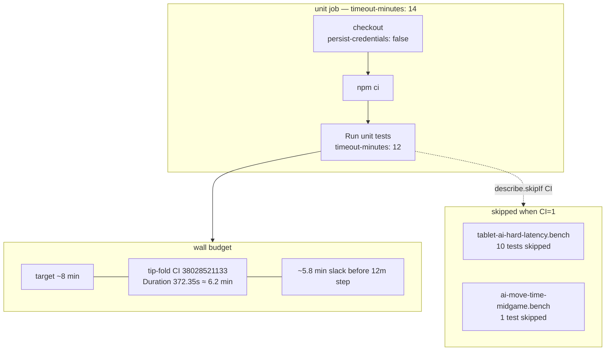

# CI unit job budget + AI-bench skips

**Task id:** `q-mp-388` (wall-budget remeasure; prior `q-mp-338` / `q-mp-289` / `q-mp-233` / `q-mp-175`)  
**Scope:** Docs / visuals only — no workflow edits, no AI timing or product changes.  
**Tip at authoring:** `cursor/mp-tip-post865` @ `3908809d` (full SHA `3908809d672ed70eede7b9c0ad63a6fa475e28e5`). Wall-budget + AI-bench CI evidence cites green tip-fold unit job [`38028521133`](https://github.com/fuzzywigg/math-pentathlon/actions/runs/38028521133) (tip SHA match on alpha after [#865](https://github.com/fuzzywigg/math-pentathlon/pull/865)) and corroborating tip-fold PR unit job [`38027675957`](https://github.com/fuzzywigg/math-pentathlon/actions/runs/38027675957) (`cursor/mp-tip-post830` fold PR, same **3210**-file suite). Older wall drafts [#843](https://github.com/fuzzywigg/math-pentathlon/pull/843) / [#810](https://github.com/fuzzywigg/math-pentathlon/pull/810) left open as **contained**. Backlog `q-mp-388` targets of **3194** / **12614** were written against tip post830 mid-fold and are stale vs live post865.

Short contributor page for the **unit** job wall budget and why the two AI latency benches stay skipped when `CI=1`. Orthogonal to the blocking-vs-report-only job graph in [`docs/dev/ci-gates-mermaid-q-mp-073.md`](../dev/ci-gates-mermaid-q-mp-073.md). Full CI-skip inventory + HOLD citations: [`docs/dev/ai-timing-ci-skip-inventory-2026-10-09.md`](../dev/ai-timing-ci-skip-inventory-2026-10-09.md). Layer file/case tables: [`docs/dev/testing-layers-2026-10-09.md`](../dev/testing-layers-2026-10-09.md) (`q-mp-260` / open [#791](https://github.com/fuzzywigg/math-pentathlon/pull/791) / backlog `q-mp-285`); this page owns the **unit wall budget** + AI-bench skip evidence only.

## Hard-rule HOLD (AI timing)

Workers must **not** change AI timing asserts, deadlines, search, scoring, or difficulty.

| Rule                                    | Live tip pin                                                                                   |
| --------------------------------------- | ---------------------------------------------------------------------------------------------- |
| Hex Hard play deadline stays **450ms**  | `src/games/hex/ai.ts` — `hard: 450`                                                            |
| Unit characterization of that pin       | `tests/unit/ai-hard-midgame-identity.test.ts` — `expect(HEX_MS.hard).toBeLessThanOrEqual(450)` |
| Do not enable the two AI benches on GHA | Keep `describe.skipIf(!!process.env.CI)` on the files below                                    |
| CI permissions stay read-only           | `permissions: contents: read` + `persist-credentials: false` on checkout                       |

Do **not** “fix” Hex Hard by raising the deadline above 450ms. Do **not** remove the CI skips to chase coverage on shared runners.

## Unit job time budget (live `ci.yml`)

From `.github/workflows/ci.yml` `unit` job (re-read on tip `3908809d`; knobs unchanged):

| Knob         | Value                                |
| ------------ | ------------------------------------ |
| Target wall  | ~**8 min** (job comment + step echo) |
| Step timeout | **12m** (`Run unit tests`)           |
| Job timeout  | **14m**                              |



## Live suite size (tip `3908809d`)

Wall evidence below is from tip-fold run [`38028521133`](https://github.com/fuzzywigg/math-pentathlon/actions/runs/38028521133) at **3210** files / Vitest Duration **372.35s**. Corroborating tip-fold PR sample [`38027675957`](https://github.com/fuzzywigg/math-pentathlon/actions/runs/38027675957) measured Duration **348.52s** at the same **3210** files (runner variance; both well under the ~8 min target). Count-table ownership for testing-layers stays with open [#791](https://github.com/fuzzywigg/math-pentathlon/pull/791) / `q-mp-285`.

| Metric                                                    |                                                                                Count | How                                                                                                               |
| --------------------------------------------------------- | -----------------------------------------------------------------------------------: | ----------------------------------------------------------------------------------------------------------------- |
| Unit files (excl. `_tokenmaxx_archive`)                   |                                                                             **3210** | `find tests/unit … \| wc -l` on tip `3908809d`                                                                    |
| Cases listed                                              |                                                                            **12768** | `npx vitest list \| wc -l` on tip `3908809d`                                                                      |
| Tip-fold CI run summary (`3908809d`)                      | **3208** passed / **2** skipped files; **12756** passed / **48** skipped (**12804**) | run [`38028521133`](https://github.com/fuzzywigg/math-pentathlon/actions/runs/38028521133) — Duration **372.35s** |
| Tip-fold PR sample (`ac05edf5`, same 3210-file tip suite) | **3208** passed / **2** skipped files; **12756** passed / **48** skipped (**12804**) | run [`38027675957`](https://github.com/fuzzywigg/math-pentathlon/actions/runs/38027675957) — Duration **348.52s** |

Vitest `list` counts and the GHA summary totals differ slightly (list includes entries that resolve differently at run time); file/case rows are tip-live. Prior post785 wall cite was Duration **276.08s** ≈ 4.6 min at **3182** files (run [`38014419139`](https://github.com/fuzzywigg/math-pentathlon/actions/runs/38014419139)).

### Post865 tip-PR unit job sample (wall only)

| Run                                                                                             | SHA        | Suite files | Vitest Duration | Unit job wall |
| ----------------------------------------------------------------------------------------------- | ---------- | ----------: | --------------: | ------------: |
| [`38028521133`](https://github.com/fuzzywigg/math-pentathlon/actions/runs/38028521133) tip-fold | `3908809d` |        3210 |     **372.35s** |          389s |
| [`38027675957`](https://github.com/fuzzywigg/math-pentathlon/actions/runs/38027675957) tip-PR   | `ac05edf5` |        3210 |     **348.52s** |          370s |
| [`38014419139`](https://github.com/fuzzywigg/math-pentathlon/actions/runs/38014419139) post785  | `c9b55cff` |        3182 |     **276.08s** |          295s |
| [`38013830311`](https://github.com/fuzzywigg/math-pentathlon/actions/runs/38013830311) #831     | `47ca886d` |        3181 |     **356.89s** |          377s |

## Two AI benches skipped under `CI=1`

| File                                              | Gate                                | Tip-fold CI evidence (run [`38028521133`](https://github.com/fuzzywigg/math-pentathlon/actions/runs/38028521133)) |
| ------------------------------------------------- | ----------------------------------- | ----------------------------------------------------------------------------------------------------------------- |
| `tests/unit/tablet-ai-hard-latency.bench.test.ts` | `describe.skipIf(!!process.env.CI)` | `(10 tests \| 10 skipped)`                                                                                        |
| `tests/unit/ai-move-time-midgame.bench.test.ts`   | `describe.skipIf(!!process.env.CI)` | `(1 test \| 1 skipped)`                                                                                           |

Together they are the **2 skipped test files** in that run’s summary: `Test Files 3208 passed | 2 skipped (3210)`.

### Screenshot / log twins (real tip CI)


Plain-text twin of the **post865 tip-fold** GHA lines (ANSI stripped): [`docs/screenshots/ci/tip-unit-ai-benches-skipped-38028521133.txt`](../screenshots/ci/tip-unit-ai-benches-skipped-38028521133.txt) — `unit suite: 3210 files`, both benches skipped, `Duration 372.35s`.

Corroborating tip-fold PR twin: [`docs/screenshots/ci/tip-unit-ai-benches-skipped-38027675957.txt`](../screenshots/ci/tip-unit-ai-benches-skipped-38027675957.txt) — Duration **348.52s** @ 3210 files.

Historical post785 twin (left for comparison): [`docs/screenshots/ci/tip-unit-ai-benches-skipped-38014419139.txt`](../screenshots/ci/tip-unit-ai-benches-skipped-38014419139.txt).

Historical post755 twin (left for comparison): [`docs/screenshots/ci/tip-unit-ai-benches-skipped-37999819714.txt`](../screenshots/ci/tip-unit-ai-benches-skipped-37999819714.txt).

Local skip smoke (same two files under `CI=1`, not the full suite): [`docs/screenshots/ci/local-CI1-ai-benches-skip-smoke.txt`](../screenshots/ci/local-CI1-ai-benches-skip-smoke.txt).

```bash
CI=1 npx vitest run --project unit-isolated tests/unit/tablet-ai-hard-latency.bench.test.ts
CI=1 npx vitest run --project unit-shared tests/unit/ai-move-time-midgame.bench.test.ts
```

## Related

- Public CI posture: [Development — CI posture](./development.md#ci-posture-public) · unit runtime note in that page
- Testing-layer counts (file/case tables): [`docs/dev/testing-layers-2026-10-09.md`](../dev/testing-layers-2026-10-09.md) (`q-mp-260` / `q-mp-285`; open [#791](https://github.com/fuzzywigg/math-pentathlon/pull/791) / [#767](https://github.com/fuzzywigg/math-pentathlon/pull/767) / [#732](https://github.com/fuzzywigg/math-pentathlon/pull/732) left open as contained)
- AI-timing CI-skip inventory + HOLD detail: [`docs/dev/ai-timing-ci-skip-inventory-2026-10-09.md`](../dev/ai-timing-ci-skip-inventory-2026-10-09.md)
- Blocking vs report-only Mermaid: [`docs/dev/ci-gates-mermaid-q-mp-073.md`](../dev/ci-gates-mermaid-q-mp-073.md)
- Prior authoring pointer: [`docs/dev/ci-unit-budget-q-mp-175.md`](../dev/ci-unit-budget-q-mp-175.md)
