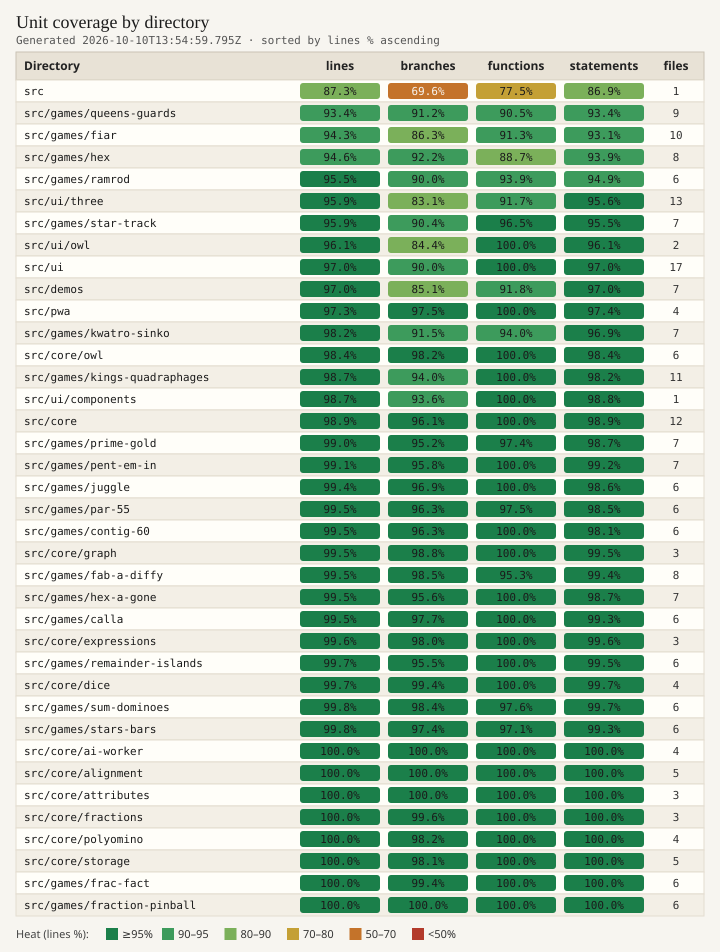

# Unit coverage heat map

**Task id:** `q-mp-532` (tip-pointer sweep to `cursor/mp-tip-post949`; heat table last regenerated by `q-mp-492` after tip post914 cut + suite **3242**/live **3245**; supersedes `q-mp-442` / `q-mp-417` / `q-mp-336` / `q-mp-311` / `q-mp-286` / `q-mp-261`; wiki visual originally `q-mp-171`; full post949 regenerate is `q-mp-537`)
**Scope:** Dev / wiki visuals only — no `src/` product edits, no AI timing or player-facing copy changes.
**Canonical artifacts:** [`docs/dev/coverage-map.md`](../dev/coverage-map.md) + [`docs/dev/coverage-map.svg`](../dev/coverage-map.svg).
**Live tip:** `cursor/mp-tip-post949` @ `68f1548f` (tip-owner fold `#977`; workers target this tip).

Per-directory vitest unit coverage (`json-summary`), sorted by **lines %** ascending so cold spots surface first. Last regenerate stamp (until `q-mp-537`): tip `cursor/mp-tip-post914` @ `63322f39` from a fresh `npm run test:unit:coverage` measured at src-identical `f5d3d04a` (tip advanced docs-only after measure; stamp in the SVG title / generated-at line of the dev doc).

## Coldest directories (lines %)

Last regenerate measurement (38 directories under `src/`):

| Directory                 | Lines % | Branches % | Files |
| ------------------------- | ------: | ---------: | ----: |
| `src`                     |   87.25 |      69.64 |     1 |
| `src/games/queens-guards` |   93.42 |      91.17 |     9 |
| `src/ui/three`            |   94.26 |      80.02 |    13 |
| `src/games/hex`           |   94.63 |      92.21 |     8 |
| `src/games/fiar`          |   94.86 |      87.10 |    10 |
| `src/games/ramrod`        |   95.47 |      90.00 |     6 |
| `src/games/star-track`    |   95.47 |      89.56 |     7 |
| `src/ui/owl`              |   96.10 |      85.43 |     2 |

Repo-wide on that run: **97.45%** lines (23290/23897), **92.45%** branches. Coverage vitest files: **3245** (3243 passed | 2 skipped). Spec cited suite **3242**; live tip after post914 soft-fail characterization folds is **3245**. Hex Hard stays **450ms**; no timing/threshold edits.

## Full heat table (SVG)



## Regenerate

```bash
npm run test:unit:coverage
npm run report:coverage-map
npm run check:dev-docs
```

Under coverage instrumentation, the local AI move-time mid-game bench can still emit **fab-a-diffy** / **fiar** / determinism `hardFlags` flakes. Do **not** change AI timing asserts or thresholds to silence those — note them in the PR instead (Hex Hard stays **450ms**). This post914 regenerate completed with EXIT 0 (no flakes).

## Related

- Dev map + regen notes: [`docs/dev/coverage-map.md`](../dev/coverage-map.md)
- Development commands: [Development](./development.md)
- CI unit budget / AI-bench skips: [CI unit budget](./ci-unit-budget.md)
