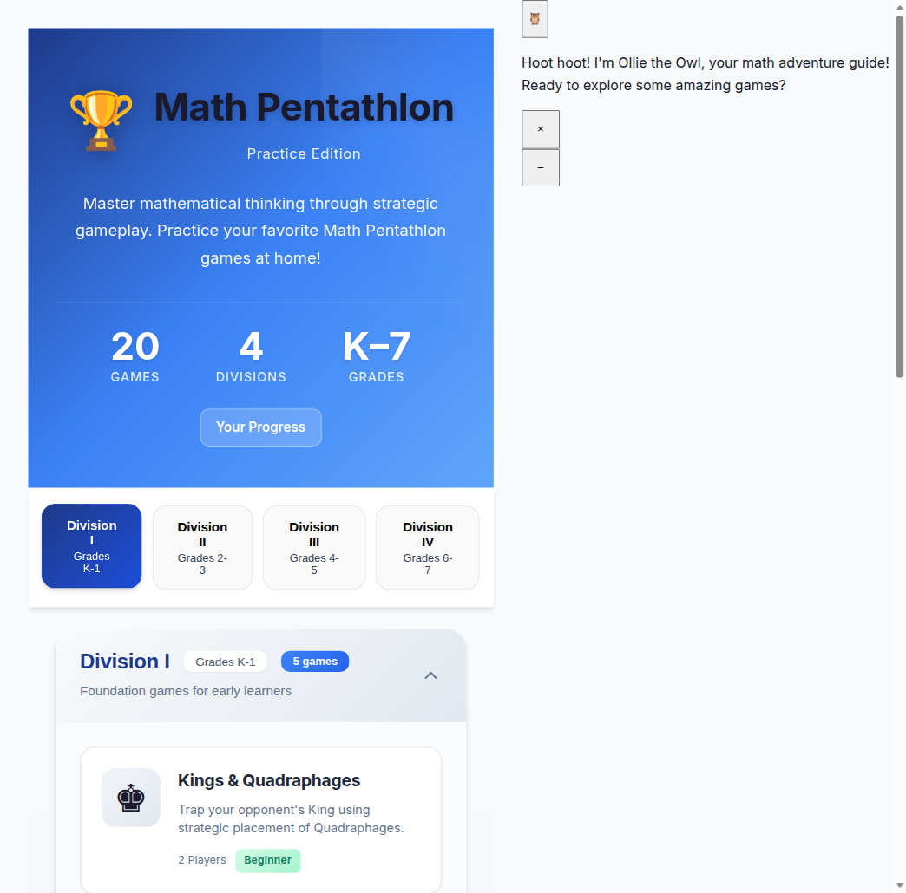
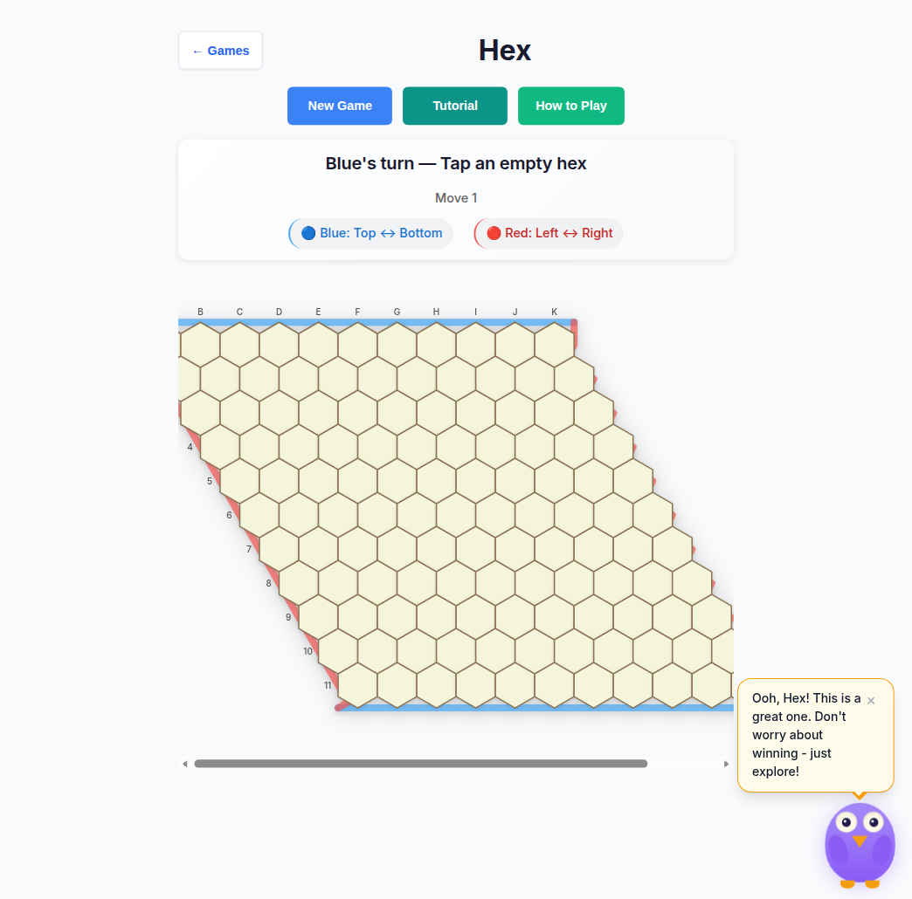

# Development

Public builder notes. Full agent/product guardrails: [`AGENTS.md`](../../AGENTS.md). Deeper coding patterns: [`.github/copilot-instructions.md`](../../.github/copilot-instructions.md).

## Stack

- Node.js **>=20** (`package.json` `engines.node`; CI/deploy pin `node-version: '20'`)
- TypeScript + Vite
- Vitest (unit) + Playwright (e2e)
- Cloudflare Pages deploy from `alpha` (see `.github/workflows/deploy.yml`)

## Commands

```bash
npm install                      # Node.js >= 20
npm run dev                      # Vite → http://localhost:5173
npm test                         # unit then Chromium e2e (CI required pair)
npm run test:unit
npm run test:unit:watch
npm run test:unit:coverage
npm run test:e2e:chromium        # required CI e2e path
npm run test:e2e:firefox-webkit  # full Firefox + WebKit suite (CI report-only)
npm run test:e2e:cross           # Firefox + WebKit + iPad WebKit
npm run test:e2e:mobile          # phone + tablet touch smoke (report-only)
npm run test:e2e:zoom-reflow     # WCAG 1.4.4/1.4.10 zoom+reflow (report-only)
npm run test:e2e:forced-colors   # forced-colors / high-contrast smoke (report-only)
npm run test:e2e:ui              # Playwright UI mode
npm run test:visual              # opt-in 2D suite (playwright.visual.config.ts; not CI)
npm run test:visual:update       # refresh separate-config baselines
npm run test:e2e:visual          # start + openings baselines (CI report-only)
npm run test:e2e:visual:update   # rewrite committed e2e visual PNG baselines
npm run build
npm run preview                  # serve dist/ after build
npm run lint
npm run lint:fix
npm run lint:ratchet             # curly:all ceiling (CI lint job; ratchet only goes down)
npm run format                   # Prettier write under src/
npm run format:check
npm run typecheck                # tsc --noEmit (same as CI)
npm run typecheck:ratchet        # ui/core shell + Phase-2 out-of-scope ceiling
npm run check:boundaries         # engine→UI import-graph ceilings (engine_imports_ui = 0)
npm run size:check               # gzip budgets (needs dist/; report-only, exit 0)
npm run check:copy-pins          # flag tests pinning player-facing copy (report-only; docs/dev/check-copy-pins.md)
npm run check:perf               # perf summary (+ optional Lighthouse); exit 0
npm run check:build              # build reproducibility probe
npm run check:pwa-manifest       # PWA manifest / installability (report-only)
npm run check:dev-docs           # engine-doc link report (report-only, exit 0)
npm run check:workflows          # workflow YAML sanity
npm run report:knip              # knip unused-export drift vs baseline (CI report-only; docs/dev/knip-report.md)
npm run report:dead-code         # fuller dead-code inventory (local; docs/dev/dead-code-inventory.md)
npm run perf:runtime             # runtime AI/move timing probe
                                 # PERF_MODE=render → tablet/CPU4× RENDER/INPUT report (docs/dev/render-perf-2026-10.md)
npm run audit:memory             # heap / detach probe across game mounts
```

`npm test` = `test:unit` && `test:e2e:chromium`. Bare `npm run test:e2e` (no `--project`) runs **every** Playwright project — prefer an explicit script. Prefer `npm run typecheck` over bare `npx tsc --noEmit` so local gates match `package.json` / CI.

Cross-browser notes: [`docs/cross-browser-2026-10-07.md`](../cross-browser-2026-10-07.md).
Mobile touch notes: [`docs/mobile-2026-10-07.md`](../mobile-2026-10-07.md).
Zoom / reflow (WCAG 1.4.4 / 1.4.10): [`docs/zoom-reflow-2026-10-08.md`](../zoom-reflow-2026-10-08.md).
Bundle budgets: [`docs/bundle-budget.md`](../bundle-budget.md). Vite `mp3d` ↔ `game-*` circular-chunk packaging note: [`docs/dev/vite-circular-chunks-mp3d.md`](../dev/vite-circular-chunks-mp3d.md). Perf: [`docs/perf-2026-10-07.md`](../perf-2026-10-07.md).

Opt-in visual regression via separate config (chromium, fixed viewport, seeded, animations off): see [`docs/visual-regression.md`](../visual-regression.md).

## Visual regression baselines

Playwright `toHaveScreenshot` covers the **start screen** and the **opening position** of every available game at two viewports:

| Project | Viewport |
| ------- | -------- |
| `visual-desktop` | 1280×720 Desktop Chrome |
| `visual-phone` | iPhone 12 size (Chromium; WebKit not required) |

Baselines live in-repo under `tests/e2e/visual-baselines/{project}/visual-baseline.spec.ts/`. Stability knobs (no production behavior change):

- Deterministic `Math.random` via Mulberry32 seed `0xC0FFEE` (init script)
- `prefers-reduced-motion: reduce` + CSS animation/transition zeroing
- Local storage: owl off, reduced motion on (avoids idle mascot paint)

### Updating baselines

Run on **Linux** (matches CI / Cloud Agent) so PNG pixels align:

```bash
npm run test:e2e:visual:update
```

Or: `npx playwright test --project=visual-desktop --project=visual-phone --update-snapshots`

Commit the changed PNGs under `tests/e2e/visual-baselines/`. Do not commit `test-results/` or `playwright-report/`.

### CI posture

Job `visual-baseline` in `.github/workflows/ci.yml` is **report-only** (`continue-on-error: true`). Diffs upload as the `visual-baseline-report` artifact but do not fail the workflow until the job is promoted to required.

## Branches

| Branch  | Role                          |
| ------- | ----------------------------- |
| `alpha` | Trunk. Target PRs here.       |
| `main`  | Not the default for new work. |

## CI posture (public)

Workflows under `.github/workflows/`:

- **CI** (`ci.yml`) — lint, `lint:ratchet`, Prettier `format:check`, `typecheck`, `typecheck:ratchet`, `check:boundaries`, `npm audit --audit-level=high`, build (hard 250 kB JS chunk budget + report-only `size:check`), unit, Chromium e2e; report-only `knip` (unused-export drift vs `docs/dev/knip-baseline.json`), `mobile-touch`, `zoom-reflow`, `forced-colors`, `e2e-cross-browser` (Firefox + WebKit), `e2e-fullgame`, and `visual-baseline` (`continue-on-error`)
- **Deploy** (`deploy.yml`) — build and publish to Cloudflare Pages on `alpha` pushes (trunk; not `main`)

### Menu shell / offline load notes

- Games and demos are dynamic-imported; Three.js stays under `dist/vendor/`.
- `vite.shell-chunks.ts` keeps game-only core (dice/fractions/…) and owl off the menu `modulepreload` graph so cheap tablets download less before first paint.
- PWA Workbox still precaches the full build after the first online visit (`src/pwa/register.ts`).
- After first paint, `bootstrapOwl` + `scheduleIdleGameWarm` warm the mascot and a couple of popular game chunks on idle (skipped when Save-Data / hidden).

### Unit job runtime

Live tip `cursor/mp-tip-post700` @ `cd33f89d` (2026-10-09): **3114** Vitest files under `tests/unit` excl. `_tokenmaxx_archive`; `npx vitest list` reports **11988** cases (includes skip/todo). Healthy GitHub Actions unit runs should finish in about **under 8 minutes** (AI latency benches are skipped under `CI=1`). Open draft [#658](https://github.com/fuzzywigg/math-pentathlon/pull/658) may change unit **timing** (headroom) but not these counts — see the measurement snapshot.

- Job `timeout-minutes: 14` and step `timeout-minutes: 12` so overrun fails loudly
- CI prints the unit file count up front
- Mermaid + tip CI screenshot of the two AI benches skipped under `CI=1` (HOLD Hex Hard **450ms**): [CI unit budget + AI-bench skips](./ci-unit-budget.md) (`q-mp-175`)

README badges link those workflows. License is **ISC** (`package.json`).

## Layout conventions

- Domain logic: `src/core`, `src/games/*/game-state.ts`, `src/games/*/rules.ts` (no DOM)
- UI wiring: `src/games/*/board-ui.ts`, `src/games/*/game-controller.ts`, `src/ui`
- Tests: `tests/unit` (Vitest + jsdom), `tests/e2e` (Playwright)
- Architecture map: [Architecture](./architecture.md) · registry: [Game registry](./game-registry.md) · new modules: [How to add a game](./adding-a-game.md)

## Testing layers

Stack of checks builders should know. Required CI paths stay green on Chromium unit + e2e; several layers are opt-in or report-only.

**Live counts** (files / listed cases) measured on tip `a023fc36` · 2026-10-09 — full tables, per-project Playwright numbers, playtest harnesses, and bench entrypoints: [`docs/dev/testing-layers-2026-10-09.md`](../dev/testing-layers-2026-10-09.md).

| Layer | Live count (tip `a023fc36`) | Runner | Command |
| ----- | --------------------------- | ------ | ------- |
| Unit | **3114** files / **11988** listed cases | Vitest (`unit-shared` / `unit-node` / `unit-isolated`) | `npm run test:unit` |
| E2E Chromium (required CI) | **25** files / **249** cases (`--grep-invert @fullgame`) | Playwright `chromium` | `npm run test:e2e:chromium` |
| E2E fullgame | **20** files / **20** cases | Playwright `chromium` + `@fullgame` | `npm run test:e2e:fullgame` |
| E2E Firefox / WebKit / iPad | **25** files / **249** cases each | `firefox` / `webkit` / `ipad-webkit` | `npm run test:e2e:firefox-webkit` · `npm run test:e2e:cross` |
| Mobile touch | **1** file / **20** cases × 3 projects | `mobile-iphone-13` / `mobile-pixel-7` / `mobile-ipad` | `npm run test:e2e:mobile` — [`docs/mobile-2026-10-07.md`](../mobile-2026-10-07.md) |
| Zoom / reflow | **1** file / **69** cases | `zoom-reflow` | `npm run test:e2e:zoom-reflow` — [`docs/zoom-reflow-2026-10-08.md`](../zoom-reflow-2026-10-08.md) |
| Forced colors | **1** file / **25** cases | `forced-colors` | `npm run test:e2e:forced-colors` |
| Visual baseline (e2e) | **1** spec × 2 projects / **21** + **21** cases; **42** PNGs | `visual-desktop` / `visual-phone` | `npm run test:e2e:visual` / `test:e2e:visual:update` (CI report-only) |
| Visual (opt-in config) | **1** file / **21** cases; **21** PNGs | `playwright.visual.config.ts` | `npm run test:visual` / `test:visual:update` (**not** CI) — [`docs/visual-regression.md`](../visual-regression.md) |
| Playtest | **4** `.mjs` harnesses · **15** report `.md` | Headless Chromium scripts (no npm script) | `node tests/playtest/…` / `node docs/playtest/…` with `npm run dev` |
| Bench (engines) | **1** file (`tests/bench/engines-rules.bench.ts`) | Vitest engines-bench config | `npm run bench:engines` |
| Axe a11y sweep | (inside Chromium e2e set) | `@axe-core/playwright` | `npm run test:e2e -- --project=chromium tests/e2e/a11y-sweep.spec.ts` — [`docs/a11y-sweep-2026-10-07.md`](../a11y-sweep-2026-10-07.md) |
| Round-trip fuzz | (inside unit set) | Vitest property tests | [`docs/state-roundtrip-2026-10-07.md`](../state-roundtrip-2026-10-07.md); `tests/unit/state-roundtrip-fuzz.test.ts` |
| Undo / move-log audit | (inside unit set) | Vitest property tests | [`docs/undo-audit-2026-10-07.md`](../undo-audit-2026-10-07.md); `tests/unit/undo-audit-*.test.ts` |

### Pin policy

New tests must **not** pin player-facing copy, AI move choice, or AI think timing. Prefer engine state / structure asserts. Hex Hard stays **450ms** real time; do not add Stars & Bars history caps. Report-only scanner: `npm run check:copy-pins` — details in [`docs/dev/testing-layers-2026-10-09.md`](../dev/testing-layers-2026-10-09.md#pin-policy-new-tests) and [`docs/dev/check-copy-pins.md`](../dev/check-copy-pins.md).

### Axe (shell)

Automated sweep over shared chrome only; board interiors stay with per-game playtests. Findings and shell fixes are recorded in the a11y sweep doc. Public posture: [Accessibility](./accessibility.md).

### Visual baseline

Two suites share the same determinism knobs (Mulberry32 seed, reduced motion, owl hidden, `board3d=0`):

- **Opt-in** `npm run test:visual` — separate `playwright.visual.config.ts`, baselines in `tests/visual/__screenshots__/`. Not wired into CI.
- **E2E projects** `npm run test:e2e:visual` — `visual-desktop` / `visual-phone` in `playwright.config.ts`, baselines under `tests/e2e/visual-baselines/`. CI job `visual-baseline` is **report-only** (`continue-on-error`).

### Round-trip fuzz

Plays capped random legal moves for every registered game, then checks:

1. Dedicated Kings codec **or** Map/Set-aware JSON revive (mid-game save stand-in)
2. `structuredClone` spot-check
3. Identical legal-move sets and seeded AI choice

On-device storage today persists stats/profile, not in-progress boards — see the findings doc.

### Undo / move-log audit

Property coverage for surfaces with undo or a move log. Most games have **no** player-facing undo UI; tests treat undo/redo as deterministic reapply of the recorded action prefix/suffix. Ambiguities (unlogged passes, truncated hex-a-gone selections, etc.) stay in the audit doc.

Live captures used in the wiki (local Vite):





## Escalations

Do not self-serve production promotions (`alpha` → `main`), scoring/schema changes, or student-facing records changes without human review (`AGENTS.md`).
