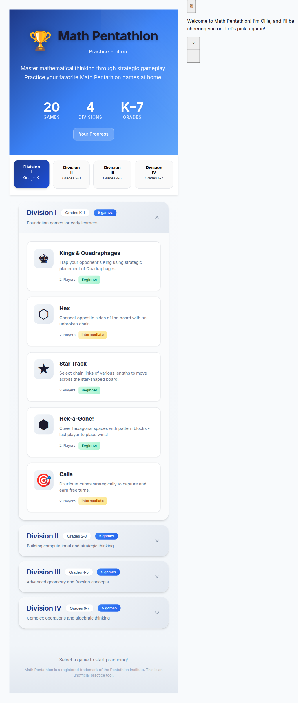

# Game registry

Canonical catalog: `src/core/game-registry.ts`. The landing menu, smoke/e2e loops, visual baselines, and axe sweep all read from this file. There is **no Math Relay** in this tree.

## Shape

```ts
interface GameInfo {
  id: string; // route segment: /#/game/<id>
  name: string;
  division: string; // e.g. "Division I"
  gradeRange: string;
  description: string;
  playerCount: string;
  difficulty: 'beginner' | 'intermediate' | 'advanced';
  icon: string;
  available: boolean;
}
```

Helpers: `getGameById`, `getAvailableGames`, `getGamesByDivision`, `getDivisionInfo`. Divisions live in the same module as `DIVISIONS`.

## How the menu uses it

`src/ui/game-selector.ts` filters `GAMES` / `DIVISIONS` into tabs, accordion sections, and cards. Clicking an available card navigates to `/#/game/<id>`.



Division I cards (viewport crop):


## How routes use it

`src/main.ts` → `renderGame()` looks up `getGameById(id)`. Missing or `available: false` games redirect home. `src/ui/game-route-mounts.ts` switches on the same string ids.

| Division | Grade band | Registry games (ids) |
| -------- | ---------- | -------------------- |
| I | K–1 | `kings-quadraphages`, `hex`, `star-track`, `hex-a-gone`, `calla` |
| II | 2–3 | `sum-dominoes`, `par-55`, `ramrod`, `kwatro-sinko`, `fiar` |
| III | 4–5 | `juggle`, `contig-60`, `stars-bars`, `fab-a-diffy`, `queens-guards` |
| IV | 6–7 | `prime-gold`, `remainder-islands`, `pent-em-in`, `frac-fact`, `fraction-pinball` |

Human-readable names and focus blurbs: [Games](./games.md).

## Checklist when editing the registry

1. `id` matches `src/games/<id>/` and a `case` in `mountGameById`.
2. `division` / `gradeRange` match an entry in `DIVISIONS`.
3. Set `available: true` only when the game mounts and has basic tests.
4. Update unit catalog tests (`tests/unit/*registry*`) and any e2e loops that assert card counts.

Adding a full module: [How to add a game](./adding-a-game.md).
